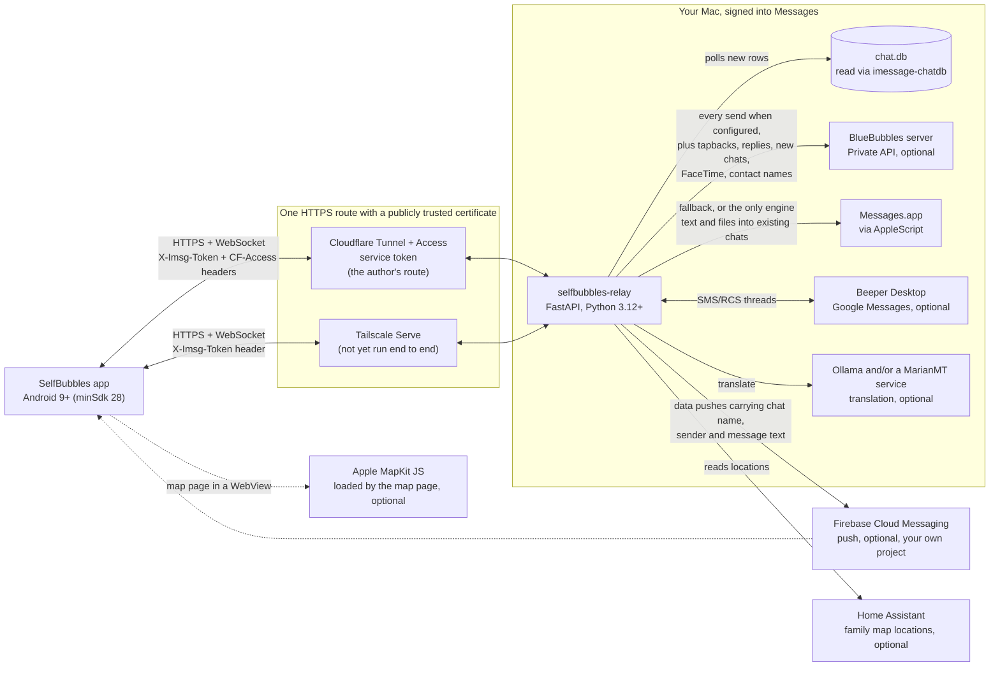

# SelfBubbles

[](https://github.com/Avtraang/selfbubbles/actions/workflows/ci.yml)

Your iMessage conversations on an Android phone — optionally with Google Messages threads and an experimental FaceTime bridge — through a relay that runs on your own Mac: no SelfBubbles server and no account with the author; the only outside services in the path are the ones you choose to add (Tailscale or Cloudflare for the route, Firebase for push, Beeper for Google Messages).

SelfBubbles is an independent, personal project. It is not affiliated with, endorsed by or supported by BlueBubbles, Beeper, Apple, Google or Cloudflare. It can use the BlueBubbles server's HTTP API as one optional sending engine and Beeper Desktop for Google Messages. iMessage, FaceTime and Messages are trademarks of Apple Inc.; Google Messages is a trademark of Google LLC.

Built with an AI assistant (Claude Code) and used daily by the author since July 2026.

This repository is the Android app (Kotlin, Jetpack Compose). The Mac side is [selfbubbles-relay](https://github.com/Avtraang/selfbubbles-relay) (FastAPI, Python), and the library that reads the Messages database is [imessage-chatdb](https://github.com/Avtraang/imessage-chatdb) (also on PyPI). The relay reports a protocol number in `GET /health` (`1` today) so the two repos can be kept in step: when you press **Test connection**, the app tells you if its relay is older than it expects.

## Screenshots

Not added yet. When they are, every screenshot will come from a synthetic demo relay (`tools/make_demo_db.py` in the relay repo) with fictional names and messages — never from a real database.

## How it works



The phone never talks to the Mac directly over the LAN: every request, at home too, goes through the HTTPS route, and the relay token (plus the Cloudflare Access pair when you use one) travels in request headers to that one origin. The relay watches `~/Library/Messages/chat.db` for new rows, sends through whichever engines you configured, and hands new messages to the phone over a WebSocket while the app is open — and over FCM while it is closed, if you built the app with your own Firebase project. What each outside service gets to see is listed under [Security model](#security-model).

## What you need

An honest list. The app has run in exactly one setup, the author's: macOS 27.0, Python 3.14, BlueBubbles with the Private API, a Cloudflare Tunnel behind Cloudflare Access, the author's own Firebase project, Beeper Desktop for Google Messages, and one Android phone. Everything outside that combination — AppleScript-only sending, Tailscale Serve, another macOS or Python version, another phone — is supported by design and by unit tests, not by daily use.

- **A Mac that stays on, awake and logged in, signed into Messages** with the Apple Account whose iMessage you want on the phone. Nothing works without it: the relay reads that Mac's Messages database and sends through Messages on that Mac. The relay runs as a per-user LaunchAgent and Messages.app lives in that user's desktop session, so after a reboot nothing works until that user has logged in on the Mac. Keep **Messages in iCloud off** on that Mac. With it on, macOS keeps older attachments only in iCloud (the app then shows "Not on the Mac anymore" for them) and, in the author's experience, the local database is not kept complete.
- **An iMessage identity on that Mac — know which one you get.** The phone sends and receives as whatever Messages on the Mac is registered for (Messages > Settings > iMessage lists the addresses). This is Apple's behaviour, not something the code controls or can check, but as far as the author knows a Mac with no iPhone behind it offers only the Apple Account's e-mail address: people who text your phone number keep reaching you by SMS/RCS on the Android phone, not through this app, unless something has registered that number with iMessage (an iPhone carrying the SIM, or a third-party registration service). This project registers nothing. SMS/RCS threads exist in the Mac's database only when a phone forwards texts to that Mac; the relay labels them, and the app shows the relay's warning above the composer ("Replies here go out as text messages through your SMS relay phone, not iMessage, and may show as Not Delivered."), because a reply there leaves through that phone or not at all. The Android phone's own SMS/RCS are the Google Messages row in the table below.
- **Full Disk Access** for the Python interpreter inside the relay's venv (System Settings > Privacy & Security). `relay.py --check` names the exact binary to grant when chat.db is not readable.
- **Automation permission** for that same Python to control Messages. macOS asks once, on the Mac's own screen, the first time the relay sends through Messages.app with AppleScript ("… wants access to control Messages"). While the prompt waits, the send waits with it (the relay gives `osascript` 20 seconds per attempt, and the app waits for the relay's answer): approve in that time and the waiting send can still go through. Otherwise the relay reports that the send failed and the app keeps the text above the composer, with what happened and a **Send again** button (see [Troubleshooting](#while-using-the-app)); the grant is listed under System Settings > Privacy & Security > Automation. The prompt belongs to the AppleScript path only: while BlueBubbles delivers every send, the relay never runs AppleScript.
- **macOS 26 or 27.** The current code has only been run on 27.0; an earlier version ran on macOS 26. Older releases differ in chat.db layout and FaceTime behaviour and are not supported. The FaceTime bridge has not been re-verified on 27 (see [Known limits](#known-limits)).
- **Python 3.12 or newer** for the relay. The pinned dependencies in the relay's `requirements.txt` were generated on the author's Python 3.14 venv; 3.12 and 3.13 have not been tried with those pins.
- **An HTTPS address for the relay with a publicly trusted certificate.** Two routes fit: a Cloudflare Tunnel behind Cloudflare Access with a service token (the author's daily route, and the only one run end to end), or Tailscale Serve (enable MagicDNS and HTTPS certificates for the tailnet, then one command on the Mac; reachable only from devices on your tailnet, so the phone must keep Tailscale connected). Tailscale Serve meets every rule the app checks, but the relay has not been run behind it end to end with this app. The app refuses `http://`, private CAs and user-installed certificates **by design**: `app/src/main/res/xml/network_security_config.xml` permits no cleartext for any host and trusts the system CA store only (no debug overrides); `RelayConfigValidator` in `RelayConfig.kt` refuses to save a relay URL that is not `https://` with a host or that carries a query string, user info or a fragment (the WebSocket URL is derived from it, `wss://` on the same host and port; the family map URL must be `https://` as well but may carry a query string and a fragment); and `app/build.gradle.kts` fails the build when a baked-in `RELAY_REMOTE_BASE` or `RELAY_REMOTE_WS` breaks those URL rules or a baked-in credential is not plain ASCII. There is no LAN mode.
- **BlueBubbles server with the Private API** (which requires SIP to be disabled on the Mac) — needed **only** for tapbacks, threaded replies, starting new conversations, Undo Send and FaceTime. With no BlueBubbles at all, the relay sends text and files into existing chats through Messages.app via AppleScript, conversations show phone numbers and e-mail addresses instead of names, group chats have no photo and the voice assistant cannot match names: the relay takes contact names and group photos from the BlueBubbles server's own endpoints (`/api/v1/contact`, `/api/v1/chat/…/icon`), which it calls with the server password only. The author has only ever run BlueBubbles with the Private API on. A server without it is untested, and because the relay always asks BlueBubbles to send with `method: private-api`, expect sends to fail there first and fall back to AppleScript.
- **Android 9 (API 28) or newer** is what the build accepts (`minSdk`), not a tested floor: the app has only ever run on the author's one phone, and no older Android version has been tried. One path exists for those versions only and has never been run on one: on Android 12 and older the composer's recent-photos grid asks for the storage permission (`READ_EXTERNAL_STORAGE`, declared up to Android 12 only) where Android 13 and newer ask for `READ_MEDIA_IMAGES` and `READ_MEDIA_VIDEO`. The choice of permission is unit-tested; the Gallery and Files buttons need no permission on any version.
- Optional: your own Firebase project (push, and the FaceTime ring), Beeper Desktop with a self-hosted `bbctl` bridge (Google Messages), Home Assistant plus an Apple MapKit JS token (family map), Ollama (translation).

## Features and what each needs

| Feature | Needs |
| --- | --- |
| Reading your conversations: everything in the Mac's Messages database (iMessage, plus SMS/RCS only if a phone forwards texts to that Mac), live updates, read and unread, pin, archive, paging back through older messages | The Mac and the relay. Updates arrive over the WebSocket while the app is open. For these chats, read/unread, pins and archive are the relay's own bookkeeping: nothing is marked read in Messages on your Apple devices and no read receipt is sent. |
| Contact photos on avatars and notifications | The phone's own address book (the `READ_CONTACTS` permission), matched by number or e-mail address, then by name — the Mac side supplies names only. |
| Sending text and files into existing chats | AppleScript (Messages.app) **or** BlueBubbles. The relay walks an engine chain — Beeper for Google Messages chats, then BlueBubbles, then AppleScript — and the first engine that succeeds wins (`SEND_ENGINES` on the relay reorders it). With BlueBubbles configured it is the primary sender and AppleScript the fallback; without it AppleScript is the only engine and needs the Automation permission above. The app refuses files over about 100 MB itself. |
| Threaded replies, tapbacks, new conversations (a recipient set with no chat yet) | The BlueBubbles Private API. Without it: a reply goes out as a plain message, a tapback does nothing (the relay answers 501 and the app shows no error), and a new recipient set gets "Couldn't start the conversation". |
| Undo Send: take back one of your own iMessages (long-press the bubble, **Undo Send**; the bubble empties) | A relay that has the `/unsend` route, and the BlueBubbles Private API behind it. iMessage only: not SMS/RCS chats on the Mac, not Google Messages threads. Your own messages only, and only a message that is one piece (text, or one attachment: a photo with a caption, or several attachments sent together, is not offered it, because the request takes back one part of a message). Only within Apple's 2 minutes of sending; the app stops offering it 10 seconds before that, and the Mac has the last word. See the relay's README for the setup. |
| Edit: change the text of one of your own iMessages (long-press the bubble, **Edit**; the composer becomes the editor and the bubble then reads "Edited") | A relay that has the `/edit` route and its `imessage-cli` tool, which drives Messages on the Mac and needs the Accessibility permission for the relay's Python. iMessage only, your own messages only, plain text only (a photo, a file, a link on its own, or a message the Mac stores with a link-preview attachment is not offered it), within Apple's 15 minutes of sending (the app stops offering it 20 seconds before that) and at most 5 times per message. The Mac may take about 20 seconds over one edit. See the relay's README for the setup. |
| Contact names and group chat photos | The BlueBubbles server (its contact and chat-icon endpoints, called with the server password). Without BlueBubbles, chats are titled by number or e-mail address and groups have no photo. |
| Google Messages (SMS/RCS) threads merged into the list, green bubbles | Beeper Desktop with its local API token (`BEEPER_TOKEN` on the relay) and a **self-hosted** Google Messages bridge run with `bbctl`: the relay only surfaces the account whose id starts with `BEEPER_GM_ACCOUNT` (default `sh-gmessages`), so Google Messages added through Beeper's own account settings is not picked up. The bridge database tells RCS from SMS. Text and replies only — **no attachments** into these threads — and only the newest 50 messages of such a thread load; paging back is for iMessage chats. |
| Notifications while the app is closed (messaging style with the sender's photo, inline reply, mark as read, one-tap copy of a 2FA code) | Your own Firebase project: `app/google-services.json` at build time **and** `FCM_CREDS` (a service-account JSON) on the relay. Without them the app is WebSocket-only: new messages show while it is open. With them, message content travels through Google (see [Security model](#security-model)). |
| Family map | In the app: a map URL, either any `https://` page of your own or the relay's `/map` page. The relay's page needs Home Assistant (`HA_TOKEN`, `HA_LOCATIONS`) and an Apple MapKit JS token (`MAPKIT_TOKEN`; it requires an Apple Developer Program membership, and a token restricted to an origin must allow your relay's hostname). For a page on the relay origin the app routes the WebView's requests through its own HTTP client, so the relay headers go with them and no token appears in the URL. **Honest status:** the author's own map is a page hosted elsewhere. The relay's `/map` route and the app's header proxy for it are unit-tested but not in daily use and have not been run end to end; and while the relay runs as a LaunchAgent, macOS Local Network privacy blocks its Python from reaching a Home Assistant on your LAN (the `Home Assistant` row of the relay's doctor table then reads `UNREACHABLE` under launchd although `relay.py --check` passes in a shell); the expected fix, not yet confirmed on the author's Mac, is to allow Python under System Settings > Privacy & Security > Local Network. Treat the relay-hosted map as untested. |
| FaceTime (**unverified on macOS 27**, see [Known limits](#known-limits)): ring on the phone, answer or decline, open the call in the browser, mint a new link | BlueBubbles with its "FaceTime Calling (Experimental)" feature on and a webhook for the `ft-call-status-changed` event pointed at the relay's `/bb_event`, **plus your own Firebase push on both ends**: an incoming ring reaches the phone only as an FCM data message (the app's WebSocket handles message events only), so a build without `google-services.json` or a relay without `FCM_CREDS` never rings; minting an outbound link works without push. Answering mints a web link that puts the phone's browser in the call's lobby, where a participant already in the call — the Mac — has to admit it. Doing that unattended is a separate, **display-specific** UI-scripting rig that stays off unless the author's Accessibility-granted helper app is present; without it, expect to need someone at the Mac to click. |
| Translation into English ("Translate" chip on a foreign-language bubble, "Always translate" per chat) | Ollama reachable from the relay, with a model you have pulled named in `OLLAMA_MODEL` (the built-in default, `qwen3:30b`, is the author's). Optionally also a MarianMT HTTP service of your own (`MARIAN_URL`, answering `POST /translate` with `{"text": …}` → `{"translation": …}`; none ships with either repository): Latin-script text goes there first and Ollama is the fallback. With MarianMT alone, non-Latin scripts are not translated. |
| Voice assistant ("Voice Text" launcher entry: speak a message, hear the relay's answer, confirm, send) | BlueBubbles: the relay matches spoken names against the contact list it gets from BlueBubbles. The phone's own speech recogniser and text-to-speech do the rest. |
| App lock (fingerprint, face or PIN before messages show; re-lock after a grace period) | A screen lock or biometric set up on the phone. Nothing else. On by default when the phone has one. |
| Share into the app (text, images, video, audio, PDF and other files from the share sheet, up to 10 items, each up to about 100 MB) | An engine that can send attachments (AppleScript or BlueBubbles). Text only into Google Messages threads. |
| Conversation shortcuts (launcher long-press menu, direct targets in the share sheet, per-conversation notification settings) | Android. A switch in Settings turns them off and removes them. |
| Search in a chat | The relay. Works in iMessage chats and, over the newest 500 messages, in Google Messages chats. |
| Built-in viewers: PDF (zoom, hand-off to another app), video (streams through the relay), voice messages (the relay converts Apple's CAF audio to m4a), HEIC photos (served as JPEG) | The relay. |
| Contact cards (vCard 2.1, 3.0 and 4.0; add to the phone's contacts) | Nothing extra. |
| Apple News link previews | The relay fetches the publisher's page in the background for an image and summary (`APPLE_NEWS_PREVIEWS=1` is the default; `0` stops every outbound fetch). |

## Settings > Features

Four switches: **Family map**, **FaceTime** (unverified on macOS 27, see [Known limits](#known-limits)), **Translation**, **Voice assistant**. The switches are yours and are the source of truth; the relay only advises.

What a switch starts as is decided at build time by the optional `FEATURES` key in `secrets.properties`:

1. `FEATURES` **present** (even as an empty `FEATURES=`) — authoritative: exactly the names listed start on (`facetime`, `map`, `translate`, `voice`); an unknown name is ignored with a Gradle warning. `secrets.properties.example` ships `FEATURES=` empty, so a build made from that file starts with the plain inbox.
2. `FEATURES` **absent** and `RELAY_REMOTE_BASE` set — all four start on (a build with a relay baked in and no `FEATURES` key keeps every feature on).
3. `FEATURES` **absent** and `RELAY_REMOTE_BASE` empty — which includes a build made with no `secrets.properties` at all — all four start off, and this build alone takes its first switch values from the relay's `/health` `features` map, once, on the first successful **Test connection** or **Save**. After that, or once you flip any switch yourself, no relay report moves a switch.

The relay derives that map from its configuration unless `FEATURE_FACETIME`, `FEATURE_MAP`, `FEATURE_TRANSLATE` or `FEATURE_VOICE` override it: `facetime` and `voice` from `BB_PASSWORD`, `map` from `MAPKIT_TOKEN` plus `HA_TOKEN`, `translate` from `OLLAMA_MODEL` or `MARIAN_URL`. The relay's shipped example configurations set all four to `0`, and its routes stay mounted either way — the flags only drive the app's UI.

Every later report only annotates the rows ("The relay reports this as unavailable."). What the switches gate: the FaceTime and map buttons in the thread list's top bar, the Translate chip and Always translate, the "Voice Text" launcher entry (disabled while off), and incoming FaceTime pushes (dropped while off; a call's "ended" event still takes down a ring posted earlier).

## Build

**New here? Follow [docs/setup.md](docs/setup.md) from the top instead of this section.** It sets up the relay and the HTTPS route first — without them the app has nothing to connect to — and gives each step a time box:

| Step | What | Time box |
| --- | --- | --- |
| 0 | Check what you need | 5 min |
| 1 | The relay on the Mac: clone, venv, `.env`, Full Disk Access, `relay.py --check`, LaunchAgent | about 15 min |
| 2 | An HTTPS route to it: Cloudflare Tunnel + Access, or Tailscale Serve | about 15 min |
| 3 | Building the app (this section, in short) | about 20 min |
| 4 | First run on the phone | about 5 min |
| 5 | Optional extras: BlueBubbles, Beeper, Firebase, Home Assistant with MapKit, translation, voice, Edit and Undo Send | later, each a separate session |
| 6 | Verify: receive, send, send a photo, leave the house | about 5 min |

That is a little over an hour of hands-on time for the plain inbox. The figures are the author's estimates and nobody else has followed the walkthrough yet; they assume Android Studio and Python 3.12+ are already installed and that you already have a domain on Cloudflare or a Tailscale account. What follows is the short reference for building the app alone.

1. Install a current Android Studio, clone this repository, open the folder in Android Studio once and let it sync, accepting its offer to install missing SDK components (the project compiles against API 37). The sync also writes `local.properties` with your SDK path; that file is git-ignored, and without it (or `ANDROID_HOME` set yourself) a command-line build on a fresh clone stops at "SDK location not found". The project uses the Gradle wrapper (9.4.1), Android Gradle Plugin 9.2.1, Kotlin 2.2.10 and the Compose BOM 2026.02.01.
2. Decide where the relay settings come from. **Either skip this step** — with no `secrets.properties` the app opens on **Connect to your relay** and you type the values on the phone — **or** `cp secrets.properties.example secrets.properties` (the copy is git-ignored). Copied as it is, the example builds the same unconfigured app: every relay key in it is present and empty, with its explanation and an example value in the comment above it, so nothing is baked in until you fill a value in. Fill in only what you want compiled into your own build: leave both `CF_ACCESS_*` values empty unless you use Cloudflare Access (set both or neither), and leave `FAMILY_MAP_URL` empty until you have a map page. The file and every key are optional; a missing or empty key becomes an empty `BuildConfig` field and the app asks for the value in Settings > Relay instead. The keys: `IMSG_TOKEN`, `CF_ACCESS_CLIENT_ID`, `CF_ACCESS_CLIENT_SECRET`, `RELAY_REMOTE_BASE` (must be `https://`), `RELAY_REMOTE_WS` (must be `wss://` on the same host and port; derived from the base when left out), `FAMILY_MAP_URL`, `FEATURES` (see above), `APP_LABEL` (the launcher label, chat-list title and unlock prompt; default `SelfBubbles`, up to 30 characters; commented out in the example) and `APPLICATION_ID` (the id the app is installed under; default `io.github.avtraang.selfbubbles`, and commented out in the example: set it only to keep installing over an app that is already on your phone under another id, or to match your own Firebase client file). Whatever you put in this file is compiled into the APK as plain strings: never share, upload or attach an APK built with it.
3. Optional: put your Firebase project's client file at `app/google-services.json` (git-ignored; it has to be the client file for this build's application id, which is `io.github.avtraang.selfbubbles` unless you set `APPLICATION_ID`; the build fails when the file has no client for that id). The google-services plugin is applied only when the file exists; without it the build has no push and says so in Settings.
4. Build and run the unit tests:

   ```sh
   export JAVA_HOME="/Applications/Android Studio.app/Contents/jbr/Contents/Home"
   ./gradlew :app:testDebugUnitTest :app:assembleDebug --console=plain -q
   ```

   The `export` line is the macOS path of Android Studio's bundled JDK (JDK 21 in the author's install; `gradle/gradle-daemon-jvm.properties` pins the Gradle daemon to 21). On Linux or Windows point `JAVA_HOME` at the `jbr` folder of your Android Studio install. Stay in the same shell for the commands below so they find Java too. The first build downloads Gradle and every dependency and, with `-q`, prints nothing while it does; leave `-q` off the first time if you want to see progress.

   `-q` also hides every Gradle warning, including the ones about missing `secrets.properties` keys, `FEATURES`, `APP_LABEL` and `google-services.json`, and a configuration-cache hit skips the phase that prints them. After editing `secrets.properties`, run `./gradlew help --console=plain` once and read the `WARNING:` lines; if the output says the configuration cache was reused and shows none, add `--no-configuration-cache` once. One line worth reading has no `WARNING:` prefix and is hidden the same way: `APPLICATION_ID not set — the app installs as "io.github.avtraang.selfbubbles"`. If an earlier build is already on your phone under another id, that build will install beside it as a separate, empty app until you set `APPLICATION_ID`.
5. `./gradlew :app:installDebug --console=plain` with the phone connected and USB debugging (or wireless debugging) enabled. A build with no `RELAY_REMOTE_BASE` and `IMSG_TOKEN` baked in (no `secrets.properties`, or those two values left empty, as the example ships them) opens — after the unlock prompt, since the app lock starts on when the phone has a screen lock, and the contacts and notification permission requests — on **Connect to your relay**: relay URL, token, optional Cloudflare Access pair, optional family map URL, **Test connection**, **Save**. Nothing is sent to a relay until you press Test connection or Save (a build that includes `google-services.json` still registers with Firebase at start).

The author runs debug builds. `app/build.gradle.kts` configures no release signing: `assembleRelease` produces an unsigned APK with code optimization off until you add your own `signingConfigs`.

The full walkthrough — relay install and LaunchAgent, Cloudflare Tunnel + Access or Tailscale Serve, BlueBubbles, Firebase, Beeper — is in [docs/setup.md](docs/setup.md). The relay's own README is in the [selfbubbles-relay](https://github.com/Avtraang/selfbubbles-relay) repository.

## Security model

- **Tunnel-only HTTPS, no cleartext.** The app reaches the relay through its HTTPS address only, at home too; there is no LAN path and no startup probe. `network_security_config.xml` forbids cleartext for every host and trusts system CAs only, the manifest sets `usesCleartextTraffic="false"`, the validator refuses anything but an `https://` relay URL (the WebSocket URL is `wss://` on the same origin), and the Gradle build fails on a baked-in URL that breaks the rule. (Probing a LAN address over plain HTTP would hand the token and the Cloudflare pair to whatever answers at that address on a foreign network; that is why there is no LAN path.)
- **Header authentication.** The relay token travels as the `X-Imsg-Token` header and the Cloudflare Access service token as `CF-Access-Client-Id` / `CF-Access-Client-Secret`, on HTTP requests and on the WebSocket upgrade alike; the app never puts either in a URL. With `IMSG_TOKEN` set, the relay checks it in constant time and answers 401 to everything but `/health` (which tells a caller without the token only `{"ok":true}`). Without a real token (none at all, or an example file's placeholder) the relay does not start: it exits with status 78, unless you ask for its unauthenticated test mode with `IMSG_ALLOW_NO_TOKEN=1` on a loopback bind, which this app cannot use. Its `--check` table shows which applies.
- **Exact-origin credential scoping.** One interceptor attaches the headers, and only when the parsed URL is `https` on the relay's exact host and port (`RelayOrigin`), so look-alike hosts, other ports, user-info tricks and plain `http` all fail; a second interceptor strips those headers from any hop that leaves the relay origin (redirects included). Each request takes one immutable snapshot of the relay config, so a new token can never pair with an old host. Images (Coil), video and audio (Media3) and the map WebView's relay requests all go through the same two interceptors.
- **No backup of secrets — but a baked-in secret is in the APK.** The relay settings (`relay_config`), the app-lock settings (`app_prefs`) and the texts not yet delivered to the relay (`outbox`) are excluded from Android Auto Backup and device-to-device transfer. A token or Cloudflare secret you are typing lives only in memory until Save; it is never written to instance state, and messages from the validator and the probe name fields, never values. Anything you put in `secrets.properties`, on the other hand, is compiled into the APK as plain strings (the repository's `.gitignore` excludes `*.apk` for that reason): never share, upload or attach an APK built that way. To give the app to someone else, build it without the file and let them type their own values.
- **Logs.** The app never logs a credential, and its own debug lines in logcat carry no message content: an incoming WebSocket frame is logged as its type and length, a failure as the kind of error, and never a message's text. Outside the family map, no line names a sender, a chat identifier, a host or a search term. With the map open, lines tagged `FamilyMap` name the address of the map page and of what it loads (scheme, host and path; when the map is the relay's own `/map`, that is the relay's host), the page's title and status, and the page's console messages. Every URL in them is cut at the query string and loses any `user:password@`, and bearer tokens, JWT-shaped strings and `token=…`/`key=…` values are masked, but the rest is whatever that page prints. Logcat is shared with the rest of the phone, so still keep USB debugging off on a phone you use daily. For an issue, attach only the app's own lines (`adb logcat -s ImsgWS Imsg Push FamilyMap`) and read them through first. The relay masks its token in its own logs, and none of its own lines carries a message's text (the voice assistant logs the length of what was dictated, not the words). They still hold chat identifiers (these contain phone numbers and e-mail addresses), contact and caller names, attachment file names and search terms; keep them private. The relay's `docs/privacy-and-logs.md` lists every line.
- **App lock.** Fingerprint, face or device PIN before the message history composes (nothing of the real UI exists behind the lock screen), with a re-lock grace of immediately, 1, 5 or 30 minutes, and an optional "Hide in Recents and block screenshots" (`FLAG_SECURE`). Turning the lock off requires authenticating first. Notifications and shade replies are not behind the lock — hide them with the phone's lock-screen notification setting — and the hands-free "Voice Text" entry is deliberately not gated (it shows no history).
- **What outside services can see.** Through a Cloudflare Tunnel, TLS ends at Cloudflare's edge, so Cloudflare can technically read everything the app and the relay exchange; with Tailscale Serve, TLS ends on your Mac. With push enabled, each incoming message's chat identifier (for a one-to-one chat, the other person's phone number or e-mail address), chat name, sender name, up to 300 characters of its text, its row number and id and, for a picture, the relay-relative path of the first image (no hostname, no token) travel through Google's Firebase Cloud Messaging as a data message, and a FaceTime ring carries the call id and the caller's name and address (leave `FCM_CREDS` unset on the relay to send nothing). Google Messages threads travel through Beeper Desktop and its bridge; what Beeper's own service sees is Beeper's to document, not this project's. The phone loads a link card's image straight from the site that hosts it when the image is not embedded in the message, the relay's `/map` page loads Apple's MapKit JS in the phone's WebView, and unless `APPLE_NEWS_PREVIEWS=0` the relay fetches each Apple News link shared with you and the publisher's page.
- **What the relay itself exposes.** The relay speaks plain HTTP on the address and port it is given (`IMSG_BIND` and `IMSG_PORT`; port 8700 by default). Its example configurations bind it to the Mac's loopback (`127.0.0.1`), which is all a tunnel or Tailscale Serve on the same Mac needs, and nothing else on your network can then connect to it. Without `IMSG_BIND` it listens on every IPv4 interface of the Mac (`0.0.0.0`, the built-in default), and on your LAN the token is then its only protection. It still accepts `?token=` in a URL because the BlueBubbles webhook cannot send headers (the relay masks that value in its logs). The app uses neither the plain-HTTP port nor `?token=`.

More detail, the threat model and how to report a vulnerability: [SECURITY.md](SECURITY.md).

## Known limits

- **chat.db schema drift.** The relay reads Apple's undocumented Messages database through imessage-chatdb. macOS updates have changed columns and GUID formats before and will again; a new macOS release can break reading until the library is updated.
- **Private API fragility.** Tapbacks, threaded replies, new chats, Undo Send and FaceTime depend on the BlueBubbles Private API, which requires SIP off and has broken across macOS point releases in the author's experience. Text and files keep moving through AppleScript when it is down.
- **Google Messages threads are text only and shallow.** Beeper Desktop is wired for text and replies; the relay answers 501 for a file, and only the newest 50 messages of such a thread load.
- **Edit and Undo Send are new, narrow and unit-tested only.** Both work on your own iMessages only (not SMS/RCS, not Google Messages threads) and inside Apple's limits: 2 minutes to unsend, 15 minutes and 5 edits to edit. Edit is for plain text: a message that is a photo, a file or only a link, or that the Mac stores with a link-preview attachment, is not offered it. Undo Send is for a message that is one piece: a photo with a caption, or several attachments sent together, is not offered it. In a chat with yourself the Mac keeps a second, received copy of each message, and that copy is not changed by an edit or an unsend. Neither goes through the outbox, and the app never repeats one by itself: when the request ends without the relay's answer it says "No answer from the relay — check the chat", because the Mac may have made the change all the same. Edits and unsends made on your other Apple devices show up as before, with one difference: one of your own messages that was unsent (from the app or from another device) no longer leaves a lone "Edited" caption under the empty space where its bubble was; a message someone else unsent still shows that caption. Edit mode lives in the app's memory: if Android stops the app in the background while you are editing, edit mode is not resumed (see "Editing message" under Troubleshooting). The rules (which messages are offered what, how each answer of the relay is read, what the composer does in edit mode) are covered by the JVM unit tests; none of it had been run on a phone, or against a relay, when it was written. See [Troubleshooting](#while-using-the-app).
- **A tapback that fails is silent.** A tapback on a relay without BlueBubbles gets a 501 and nothing is shown. One whose request fails (no network) or gets no answer within the app's 10 seconds shows nothing either; a tapback appears on its message only once the Mac has made it. A text that fails to send is never silent, whether it was typed in the composer or as a reply in a notification: it is kept on the phone and shown above its chat's composer until you send it again or discard it. The one exception is the first text of a new conversation (a recipient set with no chat yet): it is not kept that way, it stays in the New Message screen's field with a toast, and is gone if the app is closed there. See [Troubleshooting](#while-using-the-app).
- **The app cannot always tell whether a text went out, and then it asks you.** The relay has no way to recognise the same send arriving twice, so the app never repeats a send by itself. When a send ends without the relay's answer (the connection dropped after the request left, a timeout, a server error from the relay or the route) the Mac may have delivered it all the same; the app keeps the text as unsent, says "check the chat before sending again", and leaves **Send again** or **Discard** to you. It does not guess from the words of the messages in the chat.
- **The outbox is new and unit-tested only.** Keeping an unsent text above its chat's composer with **Send again**, **Copy** and **Discard**, the "Unsent messages" notification and the panel shown when the conversation list cannot be loaded are recent. Their rules (what counts as not sent, what each line says, when the panel shows) are covered by the JVM unit tests; none of it had been run on a phone when it was committed.
- **No delivery status, and no ordering between texts sent in quick succession.** A text the relay accepted shows as an ordinary bubble even when Messages on the Mac later marks it Not Delivered (the relay does not report that state). Each text is its own request: when one is slow on the Mac (BlueBubbles timing out before the AppleScript fallback), a text sent after it can arrive first.
- **FaceTime is unverified on macOS 27.** The bridge was built and exercised in July 2026 on macOS 26, on the author's previous Mac. On macOS 27 the answer, decline and link routes are covered only by the relay's tests against a scripted BlueBubbles; the step that rings the phone (BlueBubbles' webhook to the push) and the app's ring and answer screens have no automated test. The relay's `docs/facetime-bridge.md` records one incoming ring reaching the phone on macOS 27 (October 2026) and no answered call carried through to a connected call there. The unattended-admission rig scripts the FaceTime window at coordinates hard-coded for that earlier display and needs an Accessibility-granted helper app that is not in the repository; it is off by construction everywhere else and is currently switched off in the author's own deployment too. An incoming ring also needs Firebase push; without the rig, a call answered away from the Mac waits in the web lobby until someone at the Mac admits it.
- **The relay-hosted family map is untested end to end.** The author's map is a page hosted elsewhere. The relay's `/map` page and the app's header proxy for it are covered by unit tests only, and under launchd macOS Local Network privacy keeps the relay from reaching a Home Assistant on your LAN; allowing Python under System Settings > Privacy & Security > Local Network is the expected fix, not yet confirmed on the author's Mac.
- **Translation is into English only**, and non-Latin scripts need Ollama.
- **Older attachments may be gone from the Mac.** With Messages in iCloud ever on, macOS evicts older attachments; the relay answers 404 and the app says "Not on the Mac anymore". Messages.app on the Mac can fetch such an attachment again only while Messages in iCloud is switched on, which conflicts with the requirement to keep it off (the relay's README names the alternative under its Known limits).
- **Uploads are capped at about 100 MB by the app itself**, on every route. The figure is Cloudflare's request-body limit on its Free and Pro plans, which the app assumes, so it applies behind Tailscale Serve too. Through a Cloudflare Tunnel a request the relay has not answered in about 100 s also times out; the app reports both (below).
- **Read state, pins and archive are relay-local** for iMessage chats: they change nothing in Messages on your Apple devices.
- **Android 9 is the build's floor, not a tested one**, and the recent-photos grid's permission path for Android 12 and older (the storage permission) has never been run on such a phone (Gallery and Files need no permission).
- **One relay per install**, and only the author's environment is tested: macOS 27.0, Python 3.14, BlueBubbles with the Private API, Cloudflare Tunnel + Access, one phone. Tailscale Serve and AppleScript-only sending are supported by design and unit tests, not by daily use.

## Troubleshooting

Keyed by the exact text the app shows — except the first group, where it shows nothing.

### When the app shows nothing

- **A tapback does nothing.** The relay has no BlueBubbles (it answers 501). Tapbacks need the BlueBubbles Private API. The app also shows nothing when the request did not reach the relay, or got no answer within 10 seconds: a tapback that does not appear on its message was not made.
- **A reply typed in a notification is nowhere to be seen.** It is not dropped. A reply that fails, or whose send ends without an answer, raises a notification of its own ("Unsent messages" channel; it names the chat, not the text) and waits above that chat's composer with **Send again**. With the app's notifications turned off you see it the next time you open the app, as a row at the top of the conversation list. A reply the Mac is slow to send (more than about 8 seconds) clears its notification first and is finished in the background; if Android stops the app before the relay answers, no notification is raised for it: the reply waits for you the next time you open the app, as a row at the top of the conversation list (the chat's name and "1 message may not have been sent") and above that chat's composer, where it reads "The app closed before the relay answered — check the chat before sending again".
- **FaceTime never rings on the phone.** The ring arrives only as a push: check the Push notifications section below, the FaceTime switch in Settings > Features, and that BlueBubbles' webhook points at the relay's `/bb_event`.

### Test connection (first-run screen and Settings > Relay)

| The app says | Likely cause | Fix |
| --- | --- | --- |
| **Connected · relay protocol 1 · engines: applescript** (the engines are whatever the relay has configured, for example `bluebubbles, applescript`; **· features: …** follows only when the relay advertises at least one, and a relay started from its example configuration advertises none) | All good. | Save. |
| **Update the relay: it speaks protocol N, this app expects 1.** (under Connected) | An older relay, or one that sends no `protocol` at all. It still works. This note appears only under a Test connection result; nothing checks it in the background. | Pull the latest relay and restart it. |
| **The relay rejected the token** | A relay answered `/health`, but without the token-only fields: the token does not match the relay's `IMSG_TOKEN`. A relay with no token at all, or with an example file's placeholder, does not start (exit status 78) and so cannot be the cause: the test then shows what the route answers for a relay that is down, such as the Cloudflare line below. The one exception is a relay started on purpose without a token (`IMSG_ALLOW_NO_TOKEN=1` on a loopback bind, a test mode for the Mac itself): it accepts no token and reads as rejected too. | Make the two match exactly. |
| **Cloudflare Access rejected the request — check the service-token id and secret** | The address answered with HTML, a 403 or a redirect. Usually a wrong service-token pair, an Access policy that does not include the service token, or the "Behind Cloudflare Access" switch left off. Any HTML page reads the same way — including Cloudflare's error page while the tunnel is stopped or the Mac behind it is asleep or off, and a plain web server at a mistyped address. | Check the pair and the Access policy; wake the Mac, check that the tunnel is running, run `relay.py --check` and confirm the tunnel's origin is the running relay. |
| **No trusted certificate at this address; the app only speaks HTTPS** | TLS failed: a self-signed or private-CA certificate, a hostname mismatch, or nothing speaking TLS on that port. The app never accepts a user-installed certificate. | Use the Cloudflare Tunnel hostname or the Tailscale Serve HTTPS name, both of which come with a publicly trusted certificate; use the hostname the certificate is for; do not point the app at a LAN address or at the relay's own port, which has no TLS. |
| **Can't reach relay.example.com** (your relay's host) | DNS, connect or timeout failure: a typo in the host, no network, or — with Tailscale Serve — Tailscale not connected on the phone, or the Mac asleep or off. (Behind a Cloudflare Tunnel a sleeping Mac produces the Cloudflare line above instead.) | Re-check the URL, check the phone's Tailscale state, wake the Mac. |
| **HTTP 404 from that address** (or another code) | Something answered JSON or plain text with a non-2xx status: typically a relay URL with a path the relay does not serve, or a different service on that host. | The relay URL is the origin where `/health` lives, e.g. `https://relay.example.com` — no path unless you put the relay behind one. |
| **Not a relay: unexpected reply** | A 2xx that was not JSON. Something other than the relay answers there. | Check the URL and the tunnel's origin. |
| **Connection failed (SomeException)** | Anything else, named by exception class only. | Try again; check the route. |
| **Test connection is greyed out** | The relay URL is not yet an `https://` URL with a host, or the token or a Cloudflare value contains characters a header cannot carry. | Fix the field with a note under it. |

### Save is greyed out (the note under a field says why)

Save stays disabled while any rule is broken; the reason shows under the field as you type. Apart from a Test connection result, the line under the buttons only ever says "Saved" (or "Back to the build's own values" after a reset).

- **Relay URL is required.** / **Token is required.** — What an empty first-run form shows. Type the relay's HTTPS address and its `IMSG_TOKEN`.
- **Relay URL must be a https:// URL with a host (the app only speaks TLS; cleartext is not allowed).** — `http://` or no host. There is no cleartext mode.
- **Relay URL must not carry a query string (credentials travel in headers, never in a URL).** / **Relay URL must not contain user info or a #fragment.** — Remove it; the token never goes in the URL.
- **Relay URL has an invalid port.** — The port must be between 1 and 65535, or left out for 443.
- **Token must be plain ASCII text (no accents, emoji or invisible characters).** (also for the Cloudflare Access client id and client secret) — HTTP headers cannot carry anything else; pick a plain-ASCII token on the relay too.
- **Cloudflare Access is on: enter the service token's client id and secret, or turn the switch off.** / **Cloudflare Access needs both the client id and the client secret, or neither.** — The pair goes together.
- **Map URL must be empty or an https:// URL with a host.** — The family map page must be served over HTTPS as well (a query string and a fragment are fine here).

### The build fails

- **secrets.properties: RELAY_REMOTE_BASE must be a https:// URL with a host (the app only ever uses the HTTPS tunnel; cleartext is not allowed).** (likewise `RELAY_REMOTE_WS` and `wss://`) — Fix the value or delete the line and type the address on the phone.
- **secrets.properties: RELAY_REMOTE_BASE and RELAY_REMOTE_WS must point at the same host and port (credentials are only sent to the RELAY_REMOTE_BASE origin).** — Make the two match, or delete `RELAY_REMOTE_WS` and let the app derive it.
- **secrets.properties: … must not carry a query string (credentials travel in headers, never in a URL).** / **… must not contain user info or a #fragment.** / **… must be plain ASCII text (no accents, emoji or invisible characters; it is sent as an HTTP header).** — The message names the key; fix that value.
- **secrets.properties: APPLICATION_ID must be an Android application id: at least two segments separated by dots, each starting with a letter and made of letters, digits and underscores only …** — Fix the value (for example `com.example.messages`), or remove the line to install as `io.github.avtraang.selfbubbles`. An empty `APPLICATION_ID=` gets this message too: unlike the other keys, it cannot be left empty.
- **google-services.json has no client for application id … — set APPLICATION_ID in secrets.properties to the id that file was created for, or use your own Firebase client file** — `app/google-services.json` was created for a different application id than this build's (`io.github.avtraang.selfbubbles` unless `APPLICATION_ID` says otherwise). Set `APPLICATION_ID` to the package name the file was registered with, or download the client file for this build's id from your Firebase project, or remove the file to build without push. **No matching client found for package name …** (from the google-services plugin) means the same and has the same fixes; it normally only appears when you keep per-variant client files under `app/src/`.
- **SDK location not found** — Open the project in Android Studio once, or set `ANDROID_HOME` (Build, step 1).

### Settings > Push notifications

- **Push: not built in — this build has no google-services.json, so new-message alerts arrive only while the app is open (WebSocket). Add the file and rebuild to enable push.** — Expected for a build without a Firebase project. Add `app/google-services.json` and rebuild; also set `FCM_CREDS` on the relay.
- **Push notifications: Firebase (this build includes google-services.json).** — Push is built in and Firebase initialised. If nothing arrives while the app is closed, check `FCM_CREDS` on the relay (`relay.py --check` shows the `FCM push` row). The phone sends its push token to the relay when the main screen is created and again whenever a Save or a Reset changes the relay settings, so a relay typed on first run gets the token at Save, with no restart (a Save that changes nothing sends nothing: restart the app to register again). The relay logs `[fcm] registered device token (N total)` the first time it sees a token, not on later launches, so a missing line after a restart proves nothing.
- **Push: not active — this build includes google-services.json, but Firebase did not initialise, so new-message alerts arrive only while the app is open (WebSocket). Check that the file is for this app's package name and rebuild.** — Rare: the build included the file but Firebase did not start on this phone. A file made for a different application id normally fails the build instead (see above). In both cases download the client file for this app's application id from your Firebase project and rebuild.

### Settings > Features

- **The relay reports this as unavailable.** — The relay's last `/health` said the feature is off there (for the family map, only when the map URL is the relay's own `/map` or empty). The switch still works; configure the relay side (`BB_PASSWORD` for FaceTime and voice, `MAPKIT_TOKEN` and `HA_TOKEN` for the map, `OLLAMA_MODEL` or `MARIAN_URL` for translation) and delete the matching `FEATURE_*` line there (the relay's example configurations ship it as `0`, which overrides what the configuration would say), or set that line to `1`.
- **Needs a family map URL (Relay section).** — Shown while no map URL is set, whether or not the switch is on. The map button stays hidden until there is a URL and the switch is on; enter one under Settings > Relay.
- **Voice assistant is turned off in Settings** (a toast when "Voice Text" is launched) — The switch is off. Turn it on under Settings > Features; the launcher entry is enabled and disabled with the switch.

### While using the app

- **Couldn't load conversations** (in place of the thread list, with one line of reason and a **Try again** button) — The list could not be fetched and the app holds no conversation to show. It appears only while the list is empty: with conversations on screen a failed refresh changes nothing. While the first load is still running the list shows nothing for about a second, then **Loading conversations…**; a load that has not ended after about 20 seconds ends as **The relay did not answer in time**. **Try again** reloads the list (the button reads **Trying again…** while a load is in flight); the list also loads by itself when the connection to the relay comes back. For more detail than the reason line gives, tap the gear icon in the top bar, scroll to **Relay**, press **Test connection** and look the result up in the table above. The reason lines: **Can't reach the relay** (DNS or connect failure: no network, a typo in the host, Tailscale not connected, the Mac off); **The relay did not answer in time**; **No trusted certificate at the relay's address**; **The relay rejected the token** (the relay answered 401: the token is not its `IMSG_TOKEN`); **Cloudflare Access rejected the request** (a 403, a redirect or a web page answered: the service-token pair, the Access policy, or the "Behind Cloudflare Access" switch); **The relay's address answered with a server error** (a 5xx: the relay itself failed, in which case a Python traceback is at the end of `relay.err` and the request's own line in `relay.log`; or the tunnel answers for a relay or a Mac that is down); **The address did not answer like a relay** (another service, or a relay URL with a path the relay does not serve); **Connection failed** (anything else).
- **No conversations yet** — The list loaded and the relay returned no conversation at all. Check on the Mac that Messages itself shows conversations, and run `relay.py --check`. The archived view says "No archived conversations" instead.
- **Not sent** (a row above the composer with the text and **Send again**, **Copy**, **Discard**; also a toast, or a notification when the app is not on screen), followed by the reason: **can't reach the relay**, **no trusted certificate at the relay's address**, **the relay rejected the token**, **Cloudflare Access rejected the request**, **the message is too large**, **the relay refused the message**, **the relay cannot send into this chat**, **the address did not answer like a relay** — Nothing was sent, for certain: the request never left the phone, or it was refused before the relay handed it to anything (a web page answering in the relay's place, such as Cloudflare Access showing its login page for a wrong or expired service token, counts as "Cloudflare Access rejected the request"; "too large" is the route answering 413; and on a relay whose only engine for that chat is BlueBubbles, "the relay refused the message" can also be BlueBubbles refusing it, because the relay passes a 4xx answer from its one engine through). The text is not put back into the message box and nothing you have typed there is touched: it waits above the composer of its chat, is kept across restarts of the app (in the app's private storage, excluded from backup), and shows as a row at the top of the conversation list ("1 message not sent") until you tap **Send again** or **Discard**. **Copy** puts it on the clipboard if you want to edit it. A toast or notification about a chat that is not the one on screen names that chat; the notification goes when that conversation is on screen again, or once nothing of it waits for you any more. A text is called "Not sent" only when none of its sends can have gone out (see the next entry for a text sent again after a send that ended without an answer). Run **Test connection** first. "The relay cannot send into this chat" is the relay answering 501: the `send engines` row of `relay.py --check` reads `NONE`, or no configured engine handles that kind of chat.
- **No answer from the relay — check the chat before sending again** / **Connection lost before the relay answered — check the chat before sending again** / **The relay's address answered with a server error — check the chat before sending again** / **The app closed before the relay answered — check the chat before sending again** / **Can't reach the relay, but an earlier try may have gone out — check the chat before sending again** (or any other "Not sent" reason in its place; same row, toast and notification as above) — The request left the phone, or may have, and nothing certain came back: the app's own wait ran out (75 seconds, because the relay itself may take most of a minute over a send it then delivers: BlueBubbles first, then AppleScript), the connection ended first, the relay or the route in front of it answered 5xx, or the app was closed or stopped by Android while the send was in flight. The Mac may have sent the message all the same, and the app does not send it a second time by itself. While that conversation is open the app re-reads it for the next minute (also when you open it within that minute, for instance right after the app was closed over a send), so that a message that did go out shows there; then it is your call: look at the conversation, and tap **Discard** if the message is there or **Send again** if it is not. The form "…, but an earlier try may have gone out" is what a text reads after **Send again** on it failed for certain (the request never left the phone, or was refused) when an earlier send of the same text had ended without an answer: this try sent nothing, the earlier one may have, so the text is not called "Not sent" and the list counts it under "may not have been sent". A server error is also what the relay answers when every engine reported a failure, which includes an engine that only ran out of time. On an AppleScript-only relay the usual cause is the one-time macOS prompt ("… wants access to control Messages") still waiting on the Mac's screen (`relay.log` then has `[fallback] osascript error: TimeoutExpired`), or denied (a `[fallback] osascript failed: rc=…` line ending in `(-1743)`, not authorised). Allow the relay's Python under System Settings > Privacy & Security > Automation, check Messages.app on the Mac for the text, and send again. Otherwise read `relay.log` for a `[send] … failed` line.
- **Sending…** (a row above the composer, no buttons) — A text has been on its way for more than a few seconds: the Mac is slow over it (BlueBubbles not answering before the AppleScript fallback takes over). It disappears when the relay answers; there is no need to type the text again.
- **Edit** or **Undo Send** is not in the long-press panel — Each shows only where it can work, decided at the moment the panel opens: on your own message, in an iMessage chat (not SMS/RCS, not Google Messages), sent less than 2 minutes ago for Undo Send (the app stops 10 seconds early) or less than 15 minutes ago for Edit (20 seconds early). Edit also needs a plain text message: a photo, a file, a link on its own, and a message the Mac stores with a link-preview attachment have no Edit. Undo Send needs a message that is one piece: a photo with a caption, or several attachments sent together, has no Undo Send. A text still waiting above the composer has not been sent and has neither. An entry also stays hidden, for that kind of chat (one-to-one or group), once the relay has answered that it cannot do it ("This chat can't edit or unsend messages" or "Update the relay to edit or unsend", below). The app forgets that when it is restarted, when the relay's address changes, and when **Test connection** under Settings > Relay answers **Connected** for the saved relay address (a **Save** that changed something asks the relay the same way): press it after you have changed the relay, and the entries are offered again. If the relay's `/health` lists its `capabilities`, that answer also hides the entries it does not name. While the composer is editing one message, no other message is offered Edit. A message whose edit or Undo Send is on its way is offered neither, and stays that way for the moment between the relay's answer and the bubble showing the change (normally a second or two; after 3 seconds the app reads the conversation again), also after you left the conversation and came back.
- **Editing message** (a banner above the composer, with the message's text as it was) — The composer is editing that message: the field holds its text, the check-mark button saves the edit, and the X leaves edit mode. What you had typed in the composer before, and the message you were replying to, are set aside and come back when edit mode ends by the X or by a saved edit (a **Reply** chosen while editing waits the same way). An empty field cannot be saved, and saving text that says what the message already says just leaves edit mode. While the edit is on its way (a spinner in place of the button; the Mac may take about 20 seconds) the field cannot be changed and the X is off. Attachments cannot be added in edit mode: the + button is off, and a GIF from the keyboard is refused with "Attachments can't be added while editing". If the edit is refused for a reason that may pass, or ends without an answer, you stay in edit mode with your text intact; if it can no longer work (too late, already unsent, edited 5 times, or a relay or chat that cannot edit) edit mode ends and your text stays in the field as an ordinary draft, after whatever you had typed before, to send as a new message or to delete (a reply you had started is not resumed then). After an edit that ended with "No answer from the relay — check the chat" or "The Mac did not apply the change" the Mac may hold that edit all the same, so saving the message's first wording again asks the relay too, and does not just leave edit mode. The system Back gesture leaves edit mode like the X, and only a second Back leaves the conversation; while the edit is on its way Back leaves the conversation as usual. Leaving the conversation ends edit mode: an edit already on its way still finishes, but if it then fails the toast (which names the conversation, because you are no longer in it) is all there is, and what you typed is not kept. If Android stops the app in the background while you are in edit mode, edit mode is not resumed: the next time you open that conversation the composer holds what you had typed before you tapped Edit, not the half-edited text (which would otherwise be one tap from going out as a new message), and no reply target, as after any restart of the app. Whether an edit that was on its way at that moment happened shows in the bubble.
- **Unsending…** (under a bubble) — An Undo Send is on its way. When the relay confirms it, the bubble empties by itself and the caption goes with it: the relay's update usually arrives a moment after its answer, and if it has not after 3 seconds the app reads the conversation once more. Nothing is left where the bubble was (no "Edited" caption under your own unsent message).
- **Too late to unsend — Apple allows 2 minutes** / **Too late to edit — Apple allows 15 minutes** — The Mac's clock says the window is over; the panel was opened in time but the request arrived late, or the phone's clock runs behind. Nothing was changed.
- **This message was already unsent** / **This message has been edited 5 times already** / **This message can't be unsent now** / **This message can't be edited now** — The relay refused the change for that message (a 409): it is gone already, it has had Apple's five edits, or the relay gave a reason the app has no wording for (look in the relay's log). Nothing was changed.
- **This chat can't edit or unsend messages** — The relay answered 501 (in its own JSON; a 501 from anything else in front of it counts as no answer, below): it has no engine for that change (Undo Send needs the BlueBubbles Private API, Edit the relay's `imessage-cli` tool with the Accessibility permission for the relay's Python), or the chat or message is not iMessage. The entry is then hidden as described above; after setting the relay up (its README says how), press **Test connection** under Settings > Relay.
- **Update the relay to edit or unsend** — The relay answered 404 "Not Found" or 405 in its own JSON: it is from before the `/edit` and `/unsend` routes (the same statuses from anything else at the address read as "The address did not answer like a relay" and hide nothing). Pull and restart the relay, then press **Test connection** under Settings > Relay (or restart the app) so the entry is offered again.
- **The Mac did not apply the change** — The relay watched the Mac's message database and it still shows the message as it was (a 502 from the relay itself that says so). Nothing was changed as far as the relay could tell in the seconds it watched; the app reads the conversation once more 3 seconds later, in case the change landed just after. For an edit you are still in edit mode and can try again. Look in the relay's log; for Edit, check the Accessibility permission of the relay's Python. A 502 from the relay that says only that its engine failed or timed out is not this line: the Mac may still make the change, so the app says "No answer from the relay — check the chat".
- **The relay doesn't know this message** / **Only your own messages can be unsent** / **Only your own messages can be edited** / **The relay refused the request** — The relay answered 404, 403 or another 4xx for that message: it has no such message, it is not yours, or the request was not one it accepts. Nothing was changed.
- **The relay or Cloudflare Access rejected the request** / **The address did not answer like a relay** / **Can't reach the relay** (after Edit or Undo Send) — The request did not get to the relay: the token or the Cloudflare service token was refused (a 401, a 403 page, a redirect or a login page), something else answered at the address, or there was no connection. Nothing was changed. Run **Test connection** under Settings > Relay.
- **No answer from the relay — check the chat** (after Edit or Undo Send) — The request left the phone, or may have, and nothing certain came back: the app's wait ran out (75 seconds), the connection ended first, the route answered with a server error, or the relay answered 502 without saying that the Mac's database shows no change (its engine failed or timed out). The Mac may have made the change all the same, and the app does not ask a second time by itself. While the conversation stays open the app looks at that message again over the next half minute; then it is your call: look at the bubble, and try again if nothing changed. After an edit you are still in edit mode with your text. A toast about an edit or an Undo Send in a conversation that is no longer the one on screen names that conversation ("… check the chat with …", or "Edit in the chat with …: …"), so it is not read as being about the one you are looking at.
- **BlueBubbles down — sent via AppleScript fallback** (toast after a send) — A send went out through AppleScript on a relay that has delivered through BlueBubbles before: the BlueBubbles server is unreachable or refused the send (`relay.py --check` shows the `BlueBubbles` row). The message did go out. The toast appears once, with "Fallback mode — texts & photos only" above the composer, and **BlueBubbles path restored** follows when a send goes through BlueBubbles again. The app remembers, per relay address and across restarts, that a send has gone through BlueBubbles; a relay whose only engine is AppleScript never shows either. On a relay with BlueBubbles, sends that go through AppleScript before this install has seen any send go through BlueBubbles show nothing as well: until then the app cannot tell a server that is down from a relay that has none.
- **Couldn't start the conversation** — Composing to a recipient set with no existing chat needs the BlueBubbles Private API (`BB_PASSWORD` on the relay). Recipient sets that already have a chat are sent into it without BlueBubbles. The app waits up to 75 seconds for the relay here too. **The conversation may have been started — check your conversations before sending again** is the same screen when the request left the phone and nothing certain came back: the relay may have created the chat and delivered the first text, and your text is still in the field, so look at the conversation list before tapping Send a second time.
- **Not on the Mac anymore** (on an attachment) — The file is not on the Mac's disk, usually because Messages in iCloud evicted it. Messages.app on the Mac can download it again only while Messages in iCloud is on (see [Known limits](#known-limits)); if it does, try again.
- **Too large to send (limit is about 100 MB)** — The app's own cap, checked before uploading, on every route (a Cloudflare Tunnel also answers 413 over its plan's body limit). Send a smaller file, or send from the Mac.
- **Attachment timed out — it may be too large or the Mac too slow** — The route or the relay gave up waiting (a Cloudflare Tunnel answers 524 after about 100 s of silence; the app's own read and write timeouts for uploads are 5 minutes). Send a smaller file, or send from the Mac.
- **Couldn't send attachment** — Nothing was sent: the relay has no engine that can send files into that chat (a Google Messages thread, or `SEND_APPLESCRIPT_FALLBACK=0` without BlueBubbles), it refused the request, or it could not be reached. The relay's log says which.
- **The attachment may not have been sent — check the chat before sending it again** — The upload left the phone and ended without a certain answer (the connection dropped, or the relay or the route answered 5xx, which is also what the relay answers when the Mac rejected the file). The app does not upload a file a second time by itself; look at the conversation before picking it again.
- **Couldn't create the call — link generation failed on the Mac. Try again.** / **Couldn't answer — the call may have ended, or link generation failed on the Mac. Try again from the Mac.** — The relay could not get a FaceTime link from BlueBubbles: for example no BlueBubbles configured (the relay answers 501), BlueBubbles' FaceTime feature not working on this Mac, or the call already over. FaceTime is unverified on macOS 27 (see Known limits).
- **No screen lock, fingerprint or face is set up on this phone. Set one in the phone's Settings to use the app lock.** (and the two related messages under Settings > App lock) — The lock switch stays disabled until the phone has a screen lock or biometric.

## Licence

MIT — see [LICENSE](LICENSE). Copyright (c) 2026 Avtraang.

iMessage, FaceTime and Messages are trademarks of Apple Inc.; Google Messages is a trademark of Google LLC. BlueBubbles, Beeper, Cloudflare, Tailscale, Firebase and Home Assistant are names of their respective projects and companies, none of which is involved in this project.
