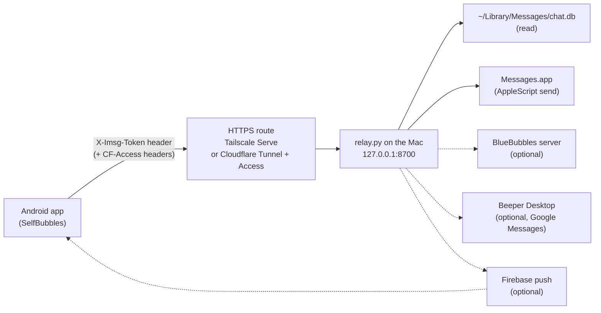

# Setting up SelfBubbles in one evening

This walkthrough takes you from a Mac that already runs Messages and an
Android phone to a working inbox: your iMessage conversations on the phone,
sending and receiving, over your own HTTPS route. Budget about **65 minutes of
hands-on time**, in this order:

| Step | What | Time |
|---|---|---|
| 0 | What you need | 5 min to check |
| 1 | The relay on the Mac | ~15 min |
| 2 | An HTTPS route to it | ~15 min |
| 3 | Building the app | ~20 min |
| 4 | First run on the phone | ~5 min |
| 5 | Optional extras | later, each is separate |
| 6 | Verify | ~5 min |

The times assume everything in step 0 is already installed. Installing Python,
Android Studio and its SDK from scratch can add 30 to 45 minutes, and a first
Cloudflare Zero Trust setup usually takes longer than 15.

Honest notes before you start:

- Nothing in this project works without a Mac that is **signed into Messages**.
  The relay reads the Messages database (`chat.db`) and sends through
  Messages.app; there is no other source of iMessage data.
- The current relay code has been run on **macOS 27.0 only** (the author's
  Mac). Earlier versions of it ran on macOS 26; nothing older has been tried.
- The author's Mac runs with **System Integrity Protection off** (the
  BlueBubbles Private API needs that), and on that Mac the relay reads
  `chat.db` whether or not its Python has a Full Disk Access grant. The setup
  this walkthrough builds first (no BlueBubbles, SIP on, Full Disk Access
  granted by hand, AppleScript as the only send engine) is covered by the
  relay's tests with a mocked `osascript`, but **the author has not run it end
  to end on a stock Mac**. Steps 1.3 and 1.6 say where that matters.
- The author's daily route is a Cloudflare tunnel (Recipe B, with one
  difference noted there). Recipe A, Tailscale Serve, has not been run end to
  end by the author.
- Click paths in System Settings, on Android and in the Cloudflare, Tailscale,
  Firebase and Beeper consoles cannot be checked against this repository and
  move between releases. They are written as of October 2026; trust the name
  of the thing you are looking for over the path to it.

The two repositories are the app, [Avtraang/selfbubbles](https://github.com/Avtraang/selfbubbles)
(this one), and the relay, [Avtraang/selfbubbles-relay](https://github.com/Avtraang/selfbubbles-relay).
File names below in `code` refer to those checkouts.



The same secret, `IMSG_TOKEN`, lives in two places: the relay's environment and
the app (typed on first run, or baked in from `secrets.properties`). The
Cloudflare Access service token, if you use Cloudflare, likewise lives in the
Access policy and in the app. Everything else stays on the Mac.

---

## 0. What you need

**The Mac**

- [ ] A Mac that stays on and awake (on a desktop Mac: System Settings >
      Energy, "Prevent automatic sleeping when the display is off"; the
      `sleep` line of `pmset -g` should read `0`), signed into Messages with
      your Apple Account, with **Messages in iCloud turned off** (System
      Settings > your Apple Account > iCloud > Messages in iCloud). With it
      on, new messages can stop landing in the local database the relay
      reads, and older attachments can end up in iCloud only. Expect updates
      and sign-ins to switch it back on silently; check it after both.
- [ ] Know which addresses Messages on this Mac can be reached at (Messages >
      Settings > iMessage). Conversations with those addresses are the only
      ones the relay will see. For an Android user with no iPhone that is
      normally the Apple Account's e-mail address, not the phone number.
- [ ] Admin rights on that Mac (you will grant Full Disk Access).
- [ ] Python 3.12 or newer on it. The `imessage-chatdb` library the relay
      depends on requires `>=3.12`; the author runs 3.14.7, and
      `requirements.txt` was pinned from that interpreter. 3.12 and 3.13 should
      install the same pins but have not been tried. The `python3` that comes
      with Apple's Command Line Tools is 3.9 and too old; install a current
      one from python.org or with `brew install python`.
- [ ] `git`, which on a Mac comes with the Xcode Command Line Tools
      (`xcode-select --install`).
- [ ] Comfort with Terminal: you will copy files, edit a text file and run a
      handful of commands.

**The route**

One of:

- [ ] A Tailscale account (free tier is enough) with the Tailscale app
      installed on the Mac and on the phone, or
- [ ] A domain whose DNS is on Cloudflare (free plan is enough).

The app refuses plain `http://` and any certificate your phone does not already
trust. There is no "LAN mode". See step 2 for why.

**The phone and the build machine**

- [ ] An Android phone on **Android 9 or newer** (`minSdk = 28`) with USB
      debugging enabled (Settings > About phone, tap Build number seven times,
      then Developer options > USB debugging; the labels vary by maker).
      Wireless debugging works too, on Android 11 and newer.
- [ ] A computer with a current **Android Studio** (the project uses Android
      Gradle Plugin 9.2.1 via Gradle 9.4.1 and Kotlin 2.2.10, with
      `compileSdk = 37`; let Studio install that SDK platform). The Mac itself
      is fine.

**Optional, for the extras in step 5**

- BlueBubbles server on the Mac, with its Private API (which needs SIP off).
- Beeper Desktop on the Mac plus `bbctl`, for Google Messages threads.
- A Firebase project, for push notifications while the app is closed.
- Home Assistant and an Apple MapKit JS token, for the family map.
- Ollama on the Mac, for message translation.

None of these is needed for texting.

---

## 1. The relay on the Mac (~15 min)

### 1.1 Clone and install

`python3 --version` must print 3.12 or newer before you start. If it prints
3.9 you are looking at Apple's copy (step 0); call the newer one by its own
name, for example `python3.14` (the version the author runs), in the
`-m venv` line below.

```sh
cd ~
git clone https://github.com/Avtraang/selfbubbles-relay.git selfbubbles-relay
cd selfbubbles-relay
python3 -m venv venv
venv/bin/pip install -r requirements.txt
```

The install pulls in `firebase-admin` and `pillow` too, which the relay does
not use until you configure push or the FaceTime rig, and `python-dotenv`,
which loads the `.env` of the next step.

### 1.2 Configure: `.env` from `.env.example`

```sh
cp .env.example .env
```

`.env` is git-ignored. The relay loads it at start (through `python-dotenv`);
anything already set in the real environment wins over the file. Open `.env`
in an editor. **The keys that matter first:**

| Key | What to put | Why |
|---|---|---|
| `IMSG_TOKEN` | A long random string, printable ASCII only. `openssl rand -hex 32` makes a good one. | The shared secret every request must carry (as the `X-Imsg-Token` header). Mandatory: the relay refuses to start (exit status 78) while this is empty or still the example's `change-me-to-a-long-random-string`, and after step 2 the relay is reachable from outside your home. The app refuses a token with non-ASCII characters because it travels in an HTTP header. |
| `IMSG_SELF` | Usually empty (`IMSG_SELF=`). Only identities that are *you* but that this Mac sees as someone else: a number registered to iMessage on another device and not on this Mac's account. Comma-separated. | The relay leaves them out when it matches a list of recipients to a chat. The example value is a sample, and the relay takes it as it is; clear it or replace it. |
| `TEXT_RELAY_LABEL` | The name of the phone that macOS forwards SMS/RCS sends to, or empty (`TEXT_RELAY_LABEL=`). | Cosmetic: shown in the chat header and in the composer's warning for the Mac's SMS/RCS threads. The example value is a sample too; clear it or replace it, or those threads name a phone you do not own. Empty shows a neutral "SMS relay phone". |
| `BB_PASSWORD` | **Leave the line commented out, as shipped, unless you run BlueBubbles.** | The example ships it as `#BB_PASSWORD=your-bluebubbles-server-password`. Commented out, or uncommented with a placeholder still in it (a value that starts with `change-me`, `changeme`, `replace-with` or `your-`), it counts as no password: the send chain is just `applescript`, which sends text and files into existing chats, and the doctor reports a placeholder as `placeholder — treated as unset`. Any other value counts as "BlueBubbles is configured": if you later delete the `FEATURE_*` lines the relay advertises FaceTime and voice, and with a value that is not a running server's password every send would try BlueBubbles first and fall through to AppleScript after a failure, and the contact lookup would fail at start. With BlueBubbles (step 5.1), uncomment the line and put the server password in. |
| `IMSG_PORT` | Leave `8700` unless the port is taken. | The port the HTTPS route in step 2 forwards to. |
| `IMSG_BIND` | Leave `127.0.0.1`. | The address the relay listens on. Loopback is all the two routes in step 2 need (both run on the Mac and connect to `127.0.0.1`), and it keeps the port closed to your LAN. Use `0.0.0.0` only if your HTTPS route reaches the relay from another machine; deleting the line also means `0.0.0.0`, the built-in default. |

Leave the four `FEATURE_FACETIME=0` / `FEATURE_MAP=0` / `FEATURE_TRANSLATE=0` /
`FEATURE_VOICE=0` lines as they are: a fresh install starts with the plain
inbox, and the app's own switches (step 4.2) decide what shows. Leave
`FCM_CREDS`, `BEEPER_TOKEN`, `HA_TOKEN` and `MAPKIT_TOKEN` empty and
`OLLAMA_MODEL`, `MARIAN_URL`, `FT_AUTOADMIT` commented out; step 5 comes back
to each. A placeholder token put into `BEEPER_TOKEN`, `HA_TOKEN` or
`MAPKIT_TOKEN` is reported by the doctor (`placeholder — treated as unset`)
and ignored, but every other value is taken as it is: an `FCM_CREDS` path that
names no file shows as `credentials file MISSING`, and a set `OLLAMA_MODEL` or
`MARIAN_URL` counts as translation being configured.

### 1.3 Full Disk Access, and the first `--check`

The relay reads `~/Library/Messages/chat.db`, which macOS protects: a program
may open it only when it, or the app that started it, has **Full Disk
Access**. Two grants are involved:

- **Your terminal app**, for the commands you run by hand in 1.3 to 1.5:
  macOS judges a command started from a terminal window by the terminal's own
  grant.
- **The Python that runs the relay**, for the LaunchAgent in 1.6, which does
  not run under a terminal.

> Not exercised by the author. On the author's Mac SIP is off and this
> protection does not bite (see the notes at the top). What follows is the
> doctor's own hint plus what is known about how macOS attributes the grant;
> it has not been walked through on a stock Mac. Treat the table the
> LaunchAgent prints in 1.6 as the real test, and please report what you find.

Run the doctor:

```sh
venv/bin/python relay.py --check
```

A few harmless lines come first: `[auth] token required`, a
`DeprecationWarning: on_event is deprecated` block from FastAPI, and
`[engines] send chain: applescript; features: (none)` (plus a `[self]` line if
you set `IMSG_SELF`; the chain reads `applescript, imessage-cli` on a Mac that
already has Beeper's `imessage-cli`, the edit tool of 5.7). Then it prints one
row per dependency (status words, the address it binds and two paths, never a
secret) and exits without starting the server. On a first run the top row is
expected to be

```
chat.db   NOT READABLE (...)   grant Full Disk Access to /Users/you/selfbubbles-relay/venv/bin/python (resolves to /path/to/python3.x) in System Settings > Privacy & Security, then restart the relay
```

Open System Settings > Privacy & Security > Full Disk Access and add:

1. **Your terminal app.** Switch it on in the list, or add it with `+`. macOS
   asks you to quit and reopen it.
2. **The resolved Python path from the hint.** Press `+`, then Cmd-Shift-G,
   and paste the path after "resolves to" (a venv's `python` is a symlink;
   the hint names the real file). Toggle it on.
3. **Possibly `Python.app` as well.** A framework build of Python (Homebrew's
   and python.org's are) re-executes itself as the `Python.app` inside the
   same framework, `…/Python.framework/Versions/3.x/Resources/Python.app`,
   and that is the name `ps` shows for the running relay. If the table the
   LaunchAgent prints in 1.6 still says `NOT READABLE`, add that app too.

Run the check again from the reopened terminal. Things to know if the row does
not turn `readable`, or once it has:

- A row reading `NOT FOUND` on a Mac where Messages works may be the same
  missing grant: without it macOS can refuse even to confirm the file is
  there. Otherwise it means what its hint says, that `IMSG_CHATDB` does not
  name the Messages database.
- A pass in the terminal proves the terminal's grant, not Python's. Step 1.6
  is where Python's own grant is tested. Once the LaunchAgent works you can
  switch the terminal's Full Disk Access off again if you prefer.
- The grant is tied to that exact path. A Python upgrade changes the resolved
  path (it contains the version number), so after one, run the check again and
  re-grant.

### 1.4 What a good table looks like

With the `.env` from 1.2 and Full Disk Access granted, a Mac without
BlueBubbles, Beeper or anything optional prints, after the lines described in
1.3:

```
[check] relay doctor
  component                 status                                                                hint
  ------------------------  --------------------------------------------------------------------  ----
  chat.db                   readable
  token (IMSG_TOKEN)        set
  listening on              127.0.0.1:8700
  BlueBubbles               no password (AppleScript only), server unreachable                    set BB_PASSWORD for tapbacks, replies, new chats, group icons, names and FaceTime
  Beeper (Google Messages)  disabled                                                              set BEEPER_TOKEN to merge Google Messages threads
  FCM push                  disabled                                                              set FCM_CREDS to a Firebase service-account JSON for push notifications
  Home Assistant            disabled                                                              set HA_TOKEN and HA_LOCATIONS for the family map
  MapKit                    not set                                                               set MAPKIT_TOKEN to serve the /map page
  translation               marian unreachable, ollama unreachable (OLLAMA_MODEL default)         /translate will fail until MARIAN_URL or OLLAMA_URL answers
  send engines              applescript
  edit / unsend             edit: not available (imessage-cli not found) | unsend: not available  to edit sent messages: brew install beeper/tap/imessage-cli; unsend needs BlueBubbles with the Private API (BB_PASSWORD)
  features advertised       (none)                                                                FEATURE_FACETIME/MAP/TRANSLATE/VOICE override what /health reports
  data dir                  /Users/you/selfbubbles-relay (writable)
  FaceTime auto-admit       off (helper app missing), script found, helper app missing            off by construction: the rig needs the Accessibility-granted helper app named by FT_ADMIT_APP (owner-specific, never rebuilt)
```

Read it as: the first two rows and `send engines` are what texting needs
(`readable`, `set`, and at least one engine). `listening on` is where the
relay answers: `127.0.0.1:8700` with the `.env` from 1.2, while
`0.0.0.0:8700` would mean every network interface of the Mac, with a hint
that says how to change it. Every "disabled", "not set", "not available" and
"unreachable" below that is an optional extra you have not set up, and the
hint names the key (for `edit / unsend`, the tool) that would turn it on. On
a Mac that already has Beeper's `imessage-cli`, that row starts `edit:
imessage-cli <version> found` and `send engines` reads `applescript,
imessage-cli` (5.7). The last row is the author's own FaceTime rig, which a
fresh checkout cannot turn on; ignore it.

If `send engines` ever reads `NONE`, every send will fail with a 501. It means
no engine is configured: you set `SEND_APPLESCRIPT_FALLBACK=0` without a
BlueBubbles password, or `SEND_ENGINES` lists only engines that are not
configured.

### 1.5 Start it in the foreground once

```sh
venv/bin/python relay.py
```

It prints the same table, then uvicorn's "Uvicorn running on
http://127.0.0.1:8700" (`0.0.0.0` only if you removed `IMSG_BIND`). On a setup
without the extras, three lines that look like errors are not: `[fcm]
FCM_CREDS not set — push notifications disabled`, `[beeper] disabled (no
BEEPER_TOKEN)` and `[contacts] BB_PASSWORD not set in the relay's env — names
won't resolve; sends go out over AppleScript. Set BB_PASSWORD and restart the
relay.` The very first start also prints `[reads] baseline initialized at
ROWID …` and two `[poll] initialized …` lines: the relay noting where in the
database it begins. If the macOS firewall asks whether Python may accept
incoming connections, either answer works for this walkthrough: both routes in
step 2 reach the relay over loopback.

If you get a traceback and "Application startup failed" instead of "Uvicorn
running", the relay could not read `chat.db`: this run is judged by the
terminal's grant (1.3).

If it prints the table, then `ERROR:    [Errno 48] error while attempting to
bind on address ('127.0.0.1', 8700): address already in use`, and exits,
another program has the port (a relay you already started counts). Stop that
program, or set `IMSG_PORT` in `.env` to a free port: from then on that number
replaces every `8700` this guide writes (the `curl` checks, `tailscale serve
--bg`, the tunnel's service address in Recipe B, the BlueBubbles webhook in
5.1).

If it stops instead with no table and exit status 78, after its one-line
`[auth]` status (`[auth] IMSG_TOKEN IS A PLACEHOLDER — …` or
`[auth] NO TOKEN SET — …`) and three more `[auth]` lines, the first of those
beginning `[auth] refusing to start`, `IMSG_TOKEN` is empty or still the
example's placeholder: set it (1.2) and start again.

From a second terminal window:

```sh
curl -s http://127.0.0.1:8700/health
# {"ok":true}
```

Then stop the relay with Ctrl-C: the LaunchAgent in 1.6 needs the port.

With the example's `IMSG_BIND=127.0.0.1` the relay listens on the Mac's
loopback only: the HTTPS route in step 2 connects to it at `127.0.0.1:8700`,
and nothing else on your LAN can reach the port. Without that line it listens
on every interface, and the token is then all that protects it there.

### 1.6 Run it as a LaunchAgent

So the relay starts whenever you log in and runs without a terminal window. (A
LaunchAgent starts at login, not at boot: after a restart or a power cut, log
in on the Mac once.)

Make sure the foreground relay from 1.5 is stopped first. Two relays cannot
share port 8700: launchd's copy would fail to start and be restarted every ten
seconds, while your `curl` checks would be answered by the one in the terminal.

```sh
cp launchd/org.selfbubbles.relay.plist.example ~/Library/LaunchAgents/org.selfbubbles.relay.plist
```

Edit that copy. Every path in it starts with `/Users/YOU/selfbubbles-relay`;
replace `YOU` with your short username (or the whole path, if you cloned
elsewhere). Then choose **one** place for the configuration:

- **Keep `.env`** (what step 1.2 set up): delete the keys inside the plist's
  `<key>EnvironmentVariables</key> <dict>…</dict>` block, all but
  `PYTHONUNBUFFERED` (below). A key that is present in the plist always
  overrides the same key in `.env`: the placeholder `IMSG_TOKEN` would hide
  your real one, and the relay would refuse to start (the three `[auth]`
  lines of 1.5, under launchd in `relay.err`); `BB_PASSWORD=CHANGE-ME` would
  hide a real BlueBubbles password, because a placeholder counts as none; and
  the sample `IMSG_SELF` and `TEXT_RELAY_LABEL`, the `FEATURE_*=0` lines and
  `FT_AUTOADMIT=0` would win over whatever you wrote in `.env`. `IMSG_BIND`
  may stay: it has the same value as in `.env`.
- **Or use the plist**: fill its `EnvironmentVariables` in instead, and
  delete `.env`. Replace the `IMSG_TOKEN` placeholder (the relay does not
  start with it), replace or remove `IMSG_SELF` and `TEXT_RELAY_LABEL`, and
  set `BB_PASSWORD` to your BlueBubbles server password, or delete that key
  if you do not run BlueBubbles: left as `CHANGE-ME` it counts as no password
  (AppleScript-only sending), and the doctor's `BlueBubbles` row then begins
  `placeholder — treated as unset`. The `IMSG_BIND`, `PYTHONUNBUFFERED`,
  `FEATURE_*` and `FT_AUTOADMIT` keys can stay as they are, and everything
  optional is already commented out.

The example already sets `PYTHONUNBUFFERED` to `1` in `EnvironmentVariables`;
keep that key either way. Python reads it itself, so it has no effect from
`.env`. The relay flushes every line it prints with or without it; the key
covers anything else that writes to the log.

Then:

```sh
launchctl bootstrap gui/$UID ~/Library/LaunchAgents/org.selfbubbles.relay.plist
```

`Bootstrap failed: 5: Input/output error` is launchd's one answer to several
mistakes: the job is already loaded (run `launchctl bootout
gui/$UID/org.selfbubbles.relay` first), a path in the plist does not exist (is
`YOU` still in it?), or the file is not valid XML (`plutil -lint
~/Library/LaunchAgents/org.selfbubbles.relay.plist` tells you).

**Check that it is up:**

```sh
curl -s http://127.0.0.1:8700/health
# {"ok":true}
```

Output goes to `relay.log` and `relay.err` beside `relay.py`
(`StandardOutPath` and `StandardErrorPath` in the plist), and launchd appends
to both:

- `relay.log` gets what the relay itself prints (the `[auth]` and `[engines]`
  lines, the doctor table, `[fcm]`, `[facetime]` and so on) and one access
  line per request. The relay flushes each line as it prints it, so the table
  is there as soon as the process has started, before any request. (That was
  checked with the output redirected to a file, which is what launchd does,
  not by watching a LaunchAgent.)
- `relay.err` gets uvicorn's own lines (`Uvicorn running on
  http://127.0.0.1:8700`), FastAPI's deprecation warning, any Python
  traceback and, when the relay refuses to start for want of a real token,
  three `[auth]` lines.

Because launchd appends, the doctor table for the latest start is the
**last** `[check] relay doctor` block in `relay.log`, not the first:

```sh
grep -n '\[check\] relay doctor' relay.log | tail -1    # then read from that line
```

That table is the real Full Disk Access test: its top row must read `chat.db
readable`. If the `curl` is refused instead, the relay is not staying up, and
the end of `relay.err` says why. A relay that cannot open `chat.db` under
launchd exits during start-up ("Application startup failed") and launchd
restarts it every ten seconds; add the `Python.app` from 1.3 to Full Disk
Access, then restart. A relay whose `IMSG_TOKEN` is missing or still a
placeholder exits before it prints the table, with status 78 and three
`[auth]` lines in `relay.err`, the first beginning `[auth] refusing to
start`; launchd then starts it again, and it exits again, until the token is
fixed (launchd's documented behaviour, which the author has not watched for
this case). The usual cause is the placeholder `IMSG_TOKEN` still in the
plist, where it beats the real one in `.env`; a `--check` from a terminal
does not show that, because it reads `.env` and not the plist. Remove or
replace the key in the plist and reload the job as below.

**Restarting later.** After a change to `.env`:

```sh
launchctl kickstart -k gui/$UID/org.selfbubbles.relay
```

After a change to the plist itself (a path, or anything in
`EnvironmentVariables`) a kickstart is not enough: launchd keeps the job as it
was loaded, old environment included. Unload it and load it again:

```sh
launchctl bootout gui/$UID/org.selfbubbles.relay; sleep 2
launchctl bootstrap gui/$UID ~/Library/LaunchAgents/org.selfbubbles.relay.plist
```

The token is masked in both log files, and none of the relay's own lines
carries the text of a message (an AppleScript send that times out logs only
`[fallback] osascript error: TimeoutExpired`). They still hold chat
identifiers (which contain phone numbers and e-mail addresses), contact and
caller names, attachment file names and search terms: keep them private. The
relay's `docs/privacy-and-logs.md` lists every line.

**One prompt still to come.** The first time the relay sends through
Messages.app, macOS shows an **Automation** prompt ("… wants access to control
Messages"). It is granted per app, so approving it for a terminal run would
not cover the LaunchAgent, which is expected to ask in Python's name at its
first send. Be at the Mac for the first send in step 6.

---

## 2. An HTTPS route to the relay (~15 min)

The app talks to one origin only, over TLS only, with the system's own trust
store ([`network_security_config.xml`](../app/src/main/res/xml/network_security_config.xml):
no cleartext, no user-installed certificates, no debug overrides). The build fails if
`RELAY_REMOTE_BASE` is not `https://`, and the Relay form in the app refuses
to save an `http://` address. The reason is a design rule: with a cleartext or
LAN fallback, any network you do not control can answer at that address and be
handed the token and the Cloudflare credentials. The app therefore has no such
fallback. So the relay must be reachable at an `https://` name with a
**publicly trusted** certificate. Two recipes give you that in about fifteen
minutes.

### Recipe A: Tailscale Serve

Tailscale puts the Mac and the phone on a private network and, with Serve,
fronts the relay with a certificate from Let's Encrypt for a name under
`ts.net`. The relay is reachable only from devices on your tailnet.

> Honesty: the author's daily route is a Cloudflare tunnel (Recipe B). Recipe
> A follows Tailscale's documented commands and satisfies every requirement
> the app checks (HTTPS, public CA, WebSocket pass-through), but it has not
> been exercised end to end by the author. If you run it, a report either way
> is welcome.

1. Install Tailscale on the Mac and on the phone and sign both into the same
   tailnet.
2. In the Tailscale admin console, under **DNS**, enable **MagicDNS** and
   **HTTPS Certificates**. Serve needs both.
3. On the Mac, publish the relay:

   ```sh
   tailscale serve --bg 8700
   ```

   With the Tailscale app from the Mac App Store or the standalone download
   there is no `tailscale` on the PATH (`command not found`): run the binary
   inside the app instead,
   `/Applications/Tailscale.app/Contents/MacOS/Tailscale serve --bg 8700`.
   Only the open-source build puts `tailscale` on your PATH.
4. Find the URL:

   ```sh
   tailscale serve status
   ```

   It prints something like `https://<mac-name>.<tailnet-name>.ts.net` →
   `http://127.0.0.1:8700`. That `https://…ts.net` address is your **Relay
   URL** for step 3 and step 4. The certificate is issued by Let's Encrypt, so
   the phone trusts it with no extra step.
5. Check from the Mac. Put the token from 1.2 into the shell first: after
   the first line below, paste it and press Return (nothing is shown, and it
   stays out of the shell history):

   ```sh
   read -rs IMSG_TOKEN
   curl -s https://<mac-name>.<tailnet-name>.ts.net/health
   # {"ok":true}
   curl -s -H "X-Imsg-Token: $IMSG_TOKEN" https://<mac-name>.<tailnet-name>.ts.net/health
   # {"ok":true,"cursor":…,"contacts":0,"self":[…],"bb_reachable":false,"engines":["applescript"],"features":{…},"protocol":1,"capabilities":[…]}
   ```

   `/health` is the only path that answers without a token, and without one
   (or with a wrong or empty one) it returns exactly `{"ok":true}`, whatever
   the query string: if the second command prints only that, the token did
   not arrive. Nothing in
   the relay limits how often a token can be tried on the other paths, which
   is one more reason for the long random token from step 1.2.

Do not use `tailscale funnel` for this: Funnel exposes the port to the whole
internet, with only the relay token between a stranger and your messages.
Serve keeps it inside your tailnet, and the phone must have Tailscale connected
to reach it.

### Recipe B: Cloudflare Tunnel + Access with a service token

A Cloudflare Tunnel makes the relay reachable at a hostname of yours from any
network, with no port opened on your router. Cloudflare Access in front of it
is a second lock: without the service token's two headers Cloudflare answers
403 and nothing reaches the relay. The app sends both locks on every request.

1. **Create the tunnel.** In the Cloudflare Zero Trust dashboard (a first
   visit asks you to pick a team name and a plan; Free is enough), go to
   Networks > Tunnels > Create a tunnel, pick **Cloudflared**, name it. Follow
   the macOS installation it shows, which is `brew install cloudflared` and a
   `sudo cloudflared service install <connector token>` line. That installs
   `cloudflared` as a system LaunchDaemon that reconnects on its own.
2. **Route the hostname.** On the tunnel's Public Hostname tab add one:
   subdomain `relay`, your domain, path empty, service type **HTTP**, URL
   **`127.0.0.1:8700`**. Use the loopback address, not the Mac's LAN IP: a
   LAN address changes with DHCP and then the public path dies with a 502,
   and the relay's example configuration binds it to `127.0.0.1`
   (`IMSG_BIND`, step 1.2), so a tunnel pointed at the LAN address cannot
   connect at all unless you set `IMSG_BIND=0.0.0.0`, which opens the port to
   your whole LAN. (The author's own tunnel still points at the Mac's LAN
   address, with the relay on its built-in `0.0.0.0`, which is how the DHCP
   failure is known; the loopback form is the recommended one, and the
   loopback bind was checked in a local run, not behind a tunnel.)
   Your Relay URL is now `https://relay.example.com`. **Do steps 3 and 4
   straight away:** until the Access application exists, the hostname is
   public with only the relay token in front of it. (Steps 3 and 4 do not
   depend on the tunnel, so doing them first should close that window
   altogether; that order has not been tried here.)
3. **Create a service token.** Access > Service Auth > Service Tokens > Create
   Service Token. Name it after the phone. Copy both values now: the **Client
   ID** (it ends in `.access`) and the **Client Secret**. The secret is shown
   once. Note the duration you choose: when the token expires, the app shows
   the Cloudflare Access line from step 4.1 and you have to create a new one.
4. **Create the Access application.** Access > Applications > Add an
   application > **Self-hosted**. Name it; application domain
   `relay.example.com`, no path (the whole host). Add one policy: any name,
   action **Service Auth**, include **Service Token** → the token you just
   created. Save. (Cloudflare moves its menu labels around; the pieces are
   always a self-hosted application on the hostname and a Service Auth policy
   naming the token.)
5. **Bypass nothing.** Do not add a Bypass policy for any path, not even
   `/health`. Through Cloudflare a bare `curl https://relay.example.com/health`
   returns **403**, and that 403 is the lock working. The relay never sees the
   request.
6. **Check from the Mac** (put the three values into shell variables first,
   each with `read -rs NAME` as in Recipe A; never paste them into a URL):

   ```sh
   curl -s -o /dev/null -w "%{http_code}\n" https://relay.example.com/health
   # 403   <- Access is in front
   curl -s -H "CF-Access-Client-Id: $CF_ID" -H "CF-Access-Client-Secret: $CF_SECRET" \
        https://relay.example.com/health
   # {"ok":true}   <- through Access, no relay token
   curl -s -H "CF-Access-Client-Id: $CF_ID" -H "CF-Access-Client-Secret: $CF_SECRET" \
        -H "X-Imsg-Token: $IMSG_TOKEN" https://relay.example.com/health
   # the full JSON with "cursor", "engines", "features", "protocol"
   ```

**Where the two values go in the app:** either as `CF_ACCESS_CLIENT_ID` and
`CF_ACCESS_CLIENT_SECRET` in `secrets.properties` (step 3.2), or typed on the
phone after turning on the **Behind Cloudflare Access** switch, into the
**Client ID** and **Client Secret** fields (step 4.1). The app adds them as the
`CF-Access-Client-Id` / `CF-Access-Client-Secret` headers on every request to
the relay origin, including the WebSocket upgrade, and strips them from any
request that goes anywhere else.

Two limits to know about. WebSockets must be allowed for the zone (they are by
default; if the app loads threads but never updates live, check Network >
WebSockets in the Cloudflare dashboard). And Cloudflare's free and Pro plans
cap a request body at 100 MB; the app applies the same cap itself on any
route, Recipe A included, and refuses a larger attachment up front with "Too
large to send (limit is about 100 MB)".

---

## 3. Building the app (~20 min)

### 3.1 Get the source into Android Studio

```sh
git clone https://github.com/Avtraang/selfbubbles.git
```

Open the folder in Android Studio and let it sync once. It will download the
Gradle wrapper (9.4.1) and ask to install missing SDK components; accept.

### 3.2 `secrets.properties` from the example

```sh
cp secrets.properties.example secrets.properties
```

It sits at the repository root, is git-ignored, and
[`app/build.gradle.kts`](../app/build.gradle.kts) reads it at configuration
time: each key becomes a `BuildConfig` field, so the Kotlin sources never
contain your values. **The file and every key in it are optional.** A missing
or empty key becomes an empty field (with one Gradle warning per key) and the
app asks for that value on first run instead.
[`secrets.properties.example`](../secrets.properties.example) ships every
relay key present and **empty**, with its explanation and an example value in
the comment above it, so the copy you just made builds an unconfigured app
until you fill something in; here is what each key does and what to put in it.

| Key | Required? | Put | Rules (enforced by the build unless noted) |
|---|---|---|---|
| `IMSG_TOKEN` | optional | The same string as the relay's `IMSG_TOKEN`. | Printable ASCII only (it is sent as the `X-Imsg-Token` header). Empty → you type it on first run. |
| `CF_ACCESS_CLIENT_ID` | Recipe B only | The service token's Client ID (`….access`). | Printable ASCII. Set both CF keys or neither: the build does **not** check the pair, and with only one set the app sends no Access headers at all. Empty both for Recipe A. |
| `CF_ACCESS_CLIENT_SECRET` | Recipe B only | The service token's Client Secret. | Same. |
| `RELAY_REMOTE_BASE` | optional | `https://relay.example.com` or your `https://….ts.net` address, no trailing slash. | Must be `https://` with a host; no query string, user info or `#fragment`, or the build fails naming the key. Empty → asked on first run. |
| `RELAY_REMOTE_WS` | optional | Leave it empty (`RELAY_REMOTE_WS=`) unless you need to spell it out as `wss://relay.example.com/ws`. | Empty is fine: the app derives `wss://<host>[:port]<path>/ws` from `RELAY_REMOTE_BASE` (the Gradle warning for it says so once `RELAY_REMOTE_BASE` is set). If you set it, it must be `wss://` on the **same host and port** as the base, with no query string, or the build fails. |
| `FAMILY_MAP_URL` | optional | Empty (`FAMILY_MAP_URL=`), or `https://relay.example.com/map` once step 5.4 is done. | **Not** checked by the build. The app's Relay form refuses to save anything but an empty value or an `https://` URL with a host; a query string and `#fragment` are allowed here. Empty hides the Map button. |
| `FEATURES` | optional, ships present and empty | A comma-separated subset of `facetime`, `map`, `translate`, `voice`, or nothing after the `=`. | See below; the line's presence matters as much as its value. |
| `APP_LABEL` | optional, ships commented out | The launcher label, up to 30 characters. | Absent or empty → "SelfBubbles". It is also the chat-list title and the "Unlock …" prompt. One line; longer values are cut at 30 with a warning. |
| `APPLICATION_ID` | optional, ships commented out | The id the app is installed under, in the form `com.example.messages`. | Absent → `io.github.avtraang.selfbubbles`. Unlike the other keys it cannot be left empty: `APPLICATION_ID=` fails the build like any malformed value, so delete the line or keep it commented out. Set it only to keep installing over an app that is already on your phone under another id (to Android a different id is a different app, with its own data and settings), or to match the package name your own Firebase client file was created for (step 5.3). At least two segments separated by dots, each starting with a letter; letters, digits and `_` only, or the build fails naming the key. With a `google-services.json` in place the build also fails when that file has no client for the id. |

`FEATURES` decides which of the four optional features start switched on.
**Present** (even as a bare `FEATURES=`) makes it authoritative: exactly the
names listed start ON, so the shipped line starts all four OFF; an unknown
name is warned about by name and ignored. **Absent** means: all four start ON
when `RELAY_REMOTE_BASE` is set in this file, all OFF otherwise, and only that
last build (no `FEATURES`, no `RELAY_REMOTE_BASE`) takes its first switch
values from the relay's `/health`, once. Every switch can be changed later in
Settings > Features (step 4.2), whatever the build said.

The simplest working file for a first build is the copy itself, unedited: it
bakes nothing in, the app opens on the relay form (step 4.1) and you type the
values on the phone. No `secrets.properties` at all, or an empty one, gives
the same app with one difference: under the shipped `FEATURES=` line the four
optional features start off and stay off until you flip them, where a build
with no `FEATURES` line takes its first switch values from the relay, once
(above, and step 4.2).

To bake your relay into your own build instead: set `RELAY_REMOTE_BASE` and
`IMSG_TOKEN`; leave `RELAY_REMOTE_WS` and `FAMILY_MAP_URL` empty
(`RELAY_REMOTE_WS=`, `FAMILY_MAP_URL=`); fill the two CF keys for Recipe B or
leave both empty for Recipe A; leave `FEATURES=` and the commented-out
`APP_LABEL` and `APPLICATION_ID` as shipped. What you fill in takes effect as
written: a `RELAY_REMOTE_WS` on another host than your base fails every Gradle
run with `RELAY_REMOTE_BASE and RELAY_REMOTE_WS must point at the same host
and port`; a CF pair is sent as headers on every request and shows Behind
Cloudflare Access as on; a map URL is what the Map button opens, and it hides
the "Needs a family map URL" hint of step 4.2. The lines that begin with
`# Example:` are comments and are never read.

Either way nothing you type on the phone is written until you tap Save.
A rebuild with a changed file takes effect on the phone with no action there
for every field you have not saved a different value for on the phone; a saved
value wins over the build's until you tap **Reset to build defaults** in
Settings > Relay.

### 3.3 Optional: `google-services.json` for push

Push notifications while the app is closed need your own Firebase project
(step 5.3). If you have one, put its Android client file at
`app/google-services.json`. It is git-ignored and the build applies the
Google Services plugin only when the file exists. It has to be the client
file for this build's application id: `io.github.avtraang.selfbubbles`, or
the `APPLICATION_ID` you set in 3.2. Without the file the app compiles
exactly the same and lives on its WebSocket while open; Settings > Push
notifications says so.

### 3.4 Read the configuration warnings once

On a Mac whose only JDK is the one inside Android Studio, a bare `./gradlew`
in a terminal stops with `Unable to locate a Java Runtime`. If yours does,
prefix every `./gradlew` command in this walkthrough with Studio's bundled
JDK, like this:

```sh
JAVA_HOME="/Applications/Android Studio.app/Contents/jbr/Contents/Home" ./gradlew help --console=plain
```

`help` needs no Android SDK, but every build task does. Android Studio's sync
in 3.1 writes where the SDK is into `local.properties` (git-ignored). If you
skipped Studio, a build stops with `SDK location not found. Define a valid SDK
location with an ANDROID_HOME environment variable or by setting the sdk.dir
path in your project's local properties file`: set `ANDROID_HOME` (Studio
installs the SDK in `~/Library/Android/sdk`) the same way as `JAVA_HOME`.

The build tells you what it found in `secrets.properties`, but only in the
configuration phase, which the usual quiet build hides. Run, from the
repository root:

```sh
./gradlew help --console=plain
```

and read the `WARNING:` lines. Those about your file start `WARNING:
secrets.properties:` and name a key: `IMSG_TOKEN is not set —
BuildConfig.IMSG_TOKEN will be empty; the app takes the value from its Relay
settings instead` (the same sentence for every key you left empty;
`RELAY_REMOTE_WS` gets it too until `RELAY_REMOTE_BASE` is set, and from then
on its line ends `the app derives wss://<RELAY_REMOTE_BASE host>/ws from
RELAY_REMOTE_BASE instead`), a `FEATURES` line (only when the file has no
`FEATURES` line at all, or the line names an unknown feature), an `APP_LABEL`
problem. One is about another file: `WARNING: google-services.json not found —
building without Firebase push`. Two more lines carry no `WARNING:` prefix,
because they report a default in use and not a problem: `APP_LABEL not set —
the app is labelled "SelfBubbles"` and `APPLICATION_ID not set — the app
installs as "io.github.avtraang.selfbubbles"`. Read the second one if an
earlier build of this app is already on your phone under another id: this
build would install beside it as a separate, empty app until you set
`APPLICATION_ID` (3.2). A `GradleException` instead of a warning means a rule
from the table above was broken (an `http://` base, a WebSocket URL on another
host, a non-ASCII token, a malformed or empty `APPLICATION_ID`, a
`google-services.json` with no client for the application id); the message
names the key and never a secret value (the application id, which is not a
secret, is the one value a message quotes).

Two things hide these warnings, which is why this step exists: a `-q` flag,
and Gradle's configuration cache (`org.gradle.configuration-cache=true` in
`gradle.properties`), which skips the configuration phase when nothing it
read has changed. Run `help` right after editing `secrets.properties`; if the
output says the configuration cache was reused and shows no warnings, add
`--no-configuration-cache` once to force them.

### 3.5 Install on the phone

Connect the phone with USB debugging on (or pair wireless debugging, Android
11 and newer), then either press Run in Android Studio or, with the
`JAVA_HOME` prefix from 3.4 if your Mac needs it:

```sh
./gradlew installDebug --console=plain
```

A debug build is what the author runs daily; there is no need for a signed
release build to use the app yourself.

---

## 4. First run (~5 min)

### 4.1 The relay form

On first launch Android asks for two permissions: **Contacts** (read on the
phone itself, for contact photos) and, on Android 13 and newer,
**Notifications** (needed for step 5.3; a denial here later looks like "push
does not work"). On a phone with a screen lock you also get an "Unlock
SelfBubbles" prompt (fingerprint, face or PIN), because App lock starts
switched on in a fresh install; Settings > App lock > Require unlock turns it
off.

With no relay baked in and nothing saved yet, the app opens on a screen
titled **Connect to your relay**, before anything touches the network. (With
`RELAY_REMOTE_BASE` and `IMSG_TOKEN` baked in, it opens straight on the thread
list; the same form is in Settings > Relay, pre-filled with the build's
values, masked.) The screen states the HTTPS requirement, names the two
routes from step 2 as examples and points at this file. Its last line says
which build this is (`Version … · build …`), as the last line of Settings
does. Its fields, exactly
as labelled:

- **Relay URL** — placeholder `https://host[:port][/path]`. Your
  `https://relay.example.com` or `https://….ts.net` address. There is no
  WebSocket field; the app derives `wss://<host>[:port]<path>/ws` from this.
- **Token** — masked, with a **Show**/**Hide** toggle. The relay's
  `IMSG_TOKEN`.
- **Behind Cloudflare Access** — a switch. Recipe B: turn it on; two more
  fields appear. Recipe A: leave it off.
  - **Client ID** — the service token's Client ID.
  - **Client Secret** — masked, with Show/Hide.
- **Family map URL (optional)** — placeholder `https://`. Leave empty until
  step 5.4.

A rule you break shows under its field, in these words: `Relay URL is
required.`, `Relay URL must be a https:// URL with a host (the app only speaks
TLS; cleartext is not allowed).`, `Relay URL must not carry a query string
(credentials travel in headers, never in a URL).`, `Token is required.`,
`Cloudflare Access needs both the client id and the client secret, or
neither.`, `Cloudflare Access is on: enter the service token's client id and
secret, or turn the switch off.`, `Token must be plain ASCII text (no
accents, emoji or invisible characters).`, `Map URL must be empty or an
https:// URL with a host.`

**Test connection** is enabled as soon as the Relay URL parses as `https://`
with a host and the credentials are header-safe; a blank token does not block
it (the test will say the relay rejected it). It makes one `GET /health` with
**the typed values**, through a throwaway client bound to them, and shows one
of these lines. While it runs you see `Testing…`.

| You see | It means | Do |
|---|---|---|
| `Connected · relay protocol 1 · engines: applescript` (plus `· features: …` when the relay advertises any) | The relay answered and accepted the token. | Save. |
| `Connected` alone, then `Update the relay: it speaks protocol 0, this app expects 1.` | An older relay without `protocol` in `/health`. It works, but update it. | Save, then update the relay. |
| `The relay rejected the token` | A relay answered as it does to anyone (`{"ok":true}` without `cursor`): the token typed here is not the relay's `IMSG_TOKEN`. A relay whose `IMSG_TOKEN` is missing or still a placeholder does not start at all (1.5; that includes a LaunchAgent plist that still pins its placeholder over `.env`, 1.6), so you get one of the lines below instead: the Cloudflare line on Recipe B, most likely `HTTP 502 from that address` on Recipe A (not verified). Only a relay started on purpose with `IMSG_ALLOW_NO_TOKEN=1`, a test mode for the Mac itself, runs without a token, and it reads as "rejected" too. | Fix the Token; compare with the relay's `IMSG_TOKEN`. |
| `Cloudflare Access rejected the request — check the service-token id and secret` | Something in front of the relay answered instead of it: a 403, a redirect, or **any HTML page**. With Recipe B that includes Cloudflare's own error page when `cloudflared` or the relay is down, even with a correct service token; an expired service token lands here too. | Repeat the three `curl`s from step 2 on the Mac. A 403 without the pair and JSON with it: Access is fine, so turn on Behind Cloudflare Access and retype both values on the phone. A 403 even with the pair: the pair, its expiry or the Access policy. A Cloudflare error page (typically 502 or 530): start `cloudflared` or the relay. |
| `No trusted certificate at this address; the app only speaks HTTPS` | TLS failed: a self-signed or private-CA certificate, a hostname mismatch, or no TLS at all on that port. | Use the `https://` name from step 2, not a LAN address or port 8700 directly. |
| `Can't reach relay.example.com` | DNS, connect or timeout failure. | Recipe A: is Tailscale connected on the phone? Recipe B: does the phone have internet, and is the hostname spelled right? (A stopped relay or `cloudflared` shows as the Cloudflare line above, not this one.) |
| `HTTP 404 from that address` (any other non-2xx code with a non-HTML body) | Something other than the relay's `/health` answered JSON or text. | Check the path part of the Relay URL. A 502 on Recipe A most likely means Tailscale Serve answered and the relay behind it did not (not verified by the author): check that the relay is running. |
| `Not a relay: unexpected reply` | 2xx but not JSON. | Wrong host or path. |
| `Connection failed (…)` | Any other failure, by exception name only. | Retry; check the route. |
| `Relay URL must be an https:// URL with a host` / `The token or the Cloudflare values contain characters a header cannot carry` | Caught before any network call. | Fix the field. |

No message ever contains a credential, and the response body is never echoed.

**Save** is enabled only while every rule passes. It validates the effective
configuration, writes only what differs from the build's own values, swaps the
live configuration atomically and shows `Saved`. On a first run the thread
list replaces the form at once and the WebSocket connects; no restart. (The
push registration of step 5.3 is repeated at this point too, so a build with
push needs no restart either.) Saving a different relay address later drops
the previous relay's conversations from the screen and loads the list from
the new one; a Save that keeps the address keeps the list. While the list has been
loading for more than about a second the screen says "Loading
conversations…"; if it cannot be loaded (after about 20 seconds at the
latest) the screen says
"Couldn't load conversations" with one line of reason and a **Try again**
button in place of an empty list; a relay with no conversations at all shows
"No conversations yet". In the background one more `/health` records what
the relay offers,
for the Features rows below. The token and the secret you type are held in
memory until Save; they survive a screen rotation but not the process being
killed (then the fields come back as whatever was saved).

The saved values go to a SharedPreferences file that is excluded from Android
Auto Backup and device-to-device transfer, so they never leave the phone.

### 4.2 Settings > Features

Open Settings with the gear icon at the right of the thread list's top bar.
Under **Features** sit four switches, each with a description:

- **Family map** — "A page of your family's locations, opened from the thread
  list." Until a map URL is saved it adds "Needs a family map URL (Relay
  section)." and the Map button stays hidden even when the switch is on.
- **FaceTime** — "Rings for incoming FaceTime calls and answers them through
  the Mac."
- **Translation** — "Translate and Always translate for messages in another
  language."
- **Voice assistant** — "The Voice Text launcher entry: speak a message, hear
  the relay's answer." Flipping it adds or removes the second launcher icon,
  **Voice Text**, right away.

The note above them says it exactly: a Test connection or Save asks the relay
what it offers; that only annotates these rows, the switches are yours. A row
gains "The relay reports this as unavailable." when the relay's `/health`
said `false` for it (for the family map, only while the map URL is empty or on
the relay's own origin, since the relay can only judge its own `/map` page).
The switch still works; the annotation is advice.

With the shipped `secrets.properties.example` (`FEATURES=` present and empty)
all four start OFF and stay OFF until you flip them; the relay's report
changes nothing. Only a build with **no** `FEATURES` line **and no**
`RELAY_REMOTE_BASE` seeds its switches from the first successful Test
connection or Save, once.

Also in Settings: **App lock** ("Require unlock": fingerprint, face or the
device PIN before messages show, with a re-lock grace period; it starts on
when the phone has a screen lock), **Privacy**
("Hide in Recents and block screenshots", the share-sheet shortcuts switch),
**Push notifications** (a one-line status; with no `google-services.json` it
reads "Push: not built in — this build has no google-services.json, so
new-message alerts arrive only while the app is open (WebSocket). Add the
file and rebuild to enable push.") and **Relay**, the same form as the first
run plus **Reset to build defaults** when the build has values of its own.

---

## 5. Optional extras

Each extra is one or two relay keys plus, sometimes, a switch in the app. The
relay's routes for all of them are always mounted; the `FEATURE_*` keys and the
app's switches only decide what the app shows. After each change, restart the
relay the way step 1.6 describes (`launchctl kickstart -k
gui/$UID/org.selfbubbles.relay` if your configuration is in `.env`, the
`bootout`/`bootstrap` pair if it is in the plist) and read the **last** doctor
table in `relay.log`.

### 5.1 BlueBubbles: names, tapbacks, replies, new chats, FaceTime

Without it, the AppleScript engine sends text and files into chats that
already exist, and that is all Messages.app's scripting dictionary offers. The
[BlueBubbles](https://bluebubbles.app) server adds two layers:

- **The server itself** adds contact names and group chat photos. The relay
  reads them from the server's contact and chat-icon endpoints, which need
  the server and its password and, as far as the relay is concerned, not the
  Private API. Without it a chat shows the raw number or e-mail and a group
  has no photo.
- **Its Private API**, which requires **System Integrity Protection off**,
  adds, through the relay's `/send`, `/react`, `/create_chat` and `/unsend`:
  - tapbacks (reactions) and threaded replies,
  - starting a new conversation from the app,
  - Undo Send (step 5.7; Edit does not use BlueBubbles),
  - the FaceTime bridge (below).

SIP off is BlueBubbles' requirement and documented by them, not something
this project can soften. The relay always sends through BlueBubbles with the
Private API method, so a server without the Private API makes every send fail
over to AppleScript; names and group photos alone might work that way, but
that combination has not been tried.

Install the BlueBubbles server on the Mac and enable its Private API. Then in
the relay's configuration set `BB_URL` (default `http://localhost:1234`) and
`BB_PASSWORD` to the server's password. The doctor row becomes `BlueBubbles
password set, server reachable` and `send engines` reads `bluebubbles,
applescript`: BlueBubbles first, AppleScript as the fallback when a macOS
update breaks the Private API injection.

**FaceTime** needs, on top of that, BlueBubbles' "FaceTime Calling
(Experimental)" feature and a webhook in the BlueBubbles server pointing at
the relay, `http://127.0.0.1:8700/bb_event?token=<your IMSG_TOKEN>`, for the
FaceTime call status event. (This is the one place the token travels in a URL:
BlueBubbles cannot set headers, and the relay masks `token=` values in its
logs.) An incoming call rings on the phone **through push only**: the relay
also announces it on the WebSocket, but the app does not act on that frame, so
incoming FaceTime needs step 5.3 on both ends even while the app is open.
Answer asks the relay, which asks BlueBubbles to answer on the Mac and mint a
`facetime.apple.com` web link, and the phone opens that link in its browser.
Expect 5–40 seconds. The outbound FaceTime button in the thread list (it mints
a link through `/ft_link`) does not need push.

To switch it on, set `FEATURE_FACETIME=1` (or delete the `FEATURE_FACETIME`
and `FEATURE_VOICE` lines, which lets the relay derive both from
`BB_PASSWORD`), restart, and turn **FaceTime** on in Settings > Features.

Be clear about what you are getting. Answering puts the phone in the call's
web lobby; a participant already in the call has to admit it, and that
participant is the Mac. The author built a Mac-side "auto-admit" rig for that
click in July 2026, on macOS 26. It is display-specific UI scripting that
depends on an Accessibility-granted helper app which is not in the repository
and cannot be rebuilt; it has not been re-verified on macOS 27 and is
currently switched off on the author's own Mac. On your checkout it is off by
construction (the doctor's last row) and the `FT_AUTOADMIT` key cannot turn it
on, so expect to click the admit check on the Mac by hand. The relay side of
answering, declining and minting a link is ordinary HTTP against BlueBubbles,
covered by tests with a scripted BlueBubbles; the ring (webhook to push to
notification) and the app's ring and answer screens have no automated test;
and the bridge as a whole was built and verified on macOS 26, on one machine,
and not again since. Treat FaceTime as experimental and everything past the
lobby as a writeup, not a feature (`docs/facetime-bridge.md` in the relay
repository has the details).

### 5.2 Beeper Desktop + bbctl: Google Messages threads in the same inbox

If your Android phone's SMS/RCS live in Google Messages, the relay can merge
those threads into the inbox through [Beeper](https://www.beeper.com) Desktop's
local API. The app never learns the difference; such a chat's id starts with
`bp:`.

- Install Beeper Desktop on the Mac and run a **self-hosted** Google Messages
  bridge with `bbctl` (`bbctl run sh-gmessages`). Do not add Google Messages
  through Beeper's own Accounts settings: that is Beeper's cloud bridge, under
  a different account id, and the relay only surfaces the account whose id
  starts with `BEEPER_GM_ACCOUNT` (default `sh-gmessages`). Pairing the bridge
  with the phone is Beeper's and mautrix's procedure and changes over time;
  follow their current documentation.
- Set `BEEPER_TOKEN` to an access token for Beeper Desktop's local API
  (`BEEPER_URL` default `http://127.0.0.1:23373`). Beeper's Desktop API
  documentation currently puts it in Beeper Desktop under Settings >
  Integrations: the "+" next to "Approved connections". Setting the key is
  what turns the bridge on in the relay.
- `BEEPER_BRIDGE_DB` defaults to the bridge's `mautrix-gmessages.db`, which
  the relay opens read-only to label a thread RCS or SMS; the doctor says
  `bridge db found` or `missing`.
- `BEEPER_GM_ACCOUNT_LABELS` (`email=Label,…`) names which phone each Google
  account lives on, for the chat header.

Limits: Google Messages threads take text and replies only. Sending an
attachment into one is refused honestly with a 501 ("no configured engine can
send attachments in this chat").

### 5.3 Firebase: notifications while the app is closed

Without push, new messages reach the app over its WebSocket only while it is
open. For notifications you need your own Firebase project; nothing of the
author's is shared.

1. Create a Firebase project. Add an **Android app** to it whose package name
   is this build's application id: `io.github.avtraang.selfbubbles`, or the
   `APPLICATION_ID` you set in `secrets.properties` (step 3.2). Download its
   `google-services.json` and put it at `app/google-services.json`. Rebuild
   and reinstall (step 3.4 and 3.5). A file made for a different package name
   stops the build, with `google-services.json has no client for application
   id … — set APPLICATION_ID in secrets.properties to the id that file was
   created for, or use your own Firebase client file` (or, with per-variant
   files under `app/src/`, the plugin's own `No matching client found for
   package name`). Settings > Push notifications should now read "Push
   notifications: Firebase (this build includes google-services.json)." If it
   says instead that the file is included but Firebase did not initialise,
   check that the file is for this build's application id and rebuild.
2. In the Firebase console, Project settings > Service accounts > Generate new
   private key. Save the JSON on the Mac, for example as `fcm-key.json` beside
   `relay.py` (that name is git-ignored), and set
   `FCM_CREDS=/Users/you/selfbubbles-relay/fcm-key.json`. Restart. The doctor
   row reads `FCM push  credentials file found`, and `relay.log` has
   `[fcm] initialized — push enabled`.

The app registers its device token with the relay (`/register_push`) each
time it starts and each time a Save or a Reset changes the relay settings, so
a relay entered on the first-run form is registered at Save;
`relay.log` then shows `[fcm] registered device token (1 total)`, once per new
token. Android's notification permission from step 4.1 must be granted. The
relay keeps the tokens in its state file and prunes dead ones. Notifications
are Android MessagingStyle, with inline reply, Mark as read and a one-tap copy
for 2FA codes.

### 5.4 Home Assistant + MapKit: the family map

> Status: the author's own Map button opens a separate page hosted elsewhere,
> not the relay's `/map`. The relay's `/map` page and the header injection
> that authenticates it inside the app's WebView are covered by unit tests,
> but the combination is not in daily use and has not been run end to end by
> the author. On the author's Mac the relay, run as a LaunchAgent, currently
> cannot reach Home Assistant on the LAN at all (the limit below).

The relay can serve a page (`/map`) that plots `device_tracker` entities from
your [Home Assistant](https://www.home-assistant.io) on an Apple map, and the
app shows it in a WebView behind the Map button.

- `HA_URL` (default `http://homeassistant.local:8123`) and `HA_TOKEN`, a
  long-lived access token from your Home Assistant profile.
- `HA_LOCATIONS`: comma-separated `Label=entity_id` pairs, for example
  `Alice=device_tracker.alice_phone,Bob=device_tracker.bob_car`.
- `MAPKIT_TOKEN`: an Apple MapKit JS token, which requires an Apple Developer
  Program membership. Its allowed origin must include your relay hostname,
  because the page is served from there.
- `FEATURE_MAP=1`, or delete the line and let the relay derive it from
  `MAPKIT_TOKEN` and `HA_TOKEN` both being set.

Restart and read the doctor. What you are aiming for is `Home Assistant
reachable, token accepted, 2 location(s) configured` and `MapKit  token set`.
Then, in the app, set the **Family map URL** (Relay section) to
`https://relay.example.com/map`, with no `?token=`: for GET requests to the
relay's own origin the WebView hands the request to the app's HTTP client,
which adds the token header, so the page and its `/locations` calls
authenticate like everything else. Turn **Family map** on in Settings >
Features; a map-pin button appears in the thread list's top bar.

Known limit: when the relay runs as a LaunchAgent, macOS's Local Network
privacy can block its Python from reaching anything on your LAN while a
`curl` from Terminal works; the doctor then reads `Home Assistant
UNREACHABLE` under launchd only. The default `homeassistant.local` name is
resolved over the local network too, so it is affected in the same way. The
expected fix is to allow Python under System Settings > Privacy & Security >
Local Network and restart the relay, and an `HA_URL` that is not on your LAN
should avoid the restriction altogether; neither has been confirmed on the
author's Mac yet.

### 5.5 Ollama or MarianMT: translation

The relay's `/translate` sends non-English text to a model on the Mac and the
app shows the result under the bubble (a Translate action per message, and
"Always translate" per thread). It skips text that already looks English or
has no letters.

- **Ollama** (the simple path): install [Ollama](https://ollama.com) on the
  Mac, pull a model, and set `OLLAMA_MODEL=<that model's name>`. `OLLAMA_URL`
  defaults to `http://localhost:11434`; `OLLAMA_KEEP_ALIVE` (default `5m`) is
  how long the model stays in memory after a request. Setting `OLLAMA_MODEL`
  is what makes the relay advertise translation (the built-in default model
  name does not).
- **MarianMT** (optional, faster for Latin-script languages): a small
  always-resident HTTP service of your own that answers
  `POST /translate` with `{"text": "…"}` → `{"translation": "…"}`. Set
  `MARIAN_URL` to it. Such a service is not part of this repository.

Routing: Latin-script text is always tried at `MARIAN_URL` first (default
`http://127.0.0.1:8701`, even when you have not set the key). If nothing
answers there it goes to Ollama; if a Marian service answers with an error,
the message is skipped. Non-Latin text goes straight to Ollama.

Then `FEATURE_TRANSLATE=1` (or delete the line), restart, and turn
**Translation** on in Settings > Features.

### 5.6 Voice assistant

The app registers a second launcher entry, **Voice Text**, for "Hey Google,
open Voice Text": it listens, asks the relay who you mean and what to send,
speaks the answer back, and sends on a yes. The matching runs on the relay
(`/v/prepare` and `/v/confirm`) over the contact names it gets from
BlueBubbles, which is why the relay advertises `voice` together with
`facetime` only when `BB_PASSWORD` is set; without BlueBubbles, names will not
resolve. Set `FEATURE_VOICE=1` (or delete the line) so the Settings row stops
saying "The relay reports this as unavailable.", then turn **Voice assistant**
on in Settings > Features to show the launcher entry. It is deliberately not
behind the app lock: it shows no history, only the answer to the one question
you spoke.

### 5.7 Edit and Undo Send

A long press on one of your own recent iMessages offers **Undo Send** (Apple
allows 2 minutes) and **Edit** (15 minutes, at most 5 edits, plain text only).
The app has nothing to configure for either; both are the relay's work:

- **Undo Send** goes through the BlueBubbles Private API (step 5.1).
- **Edit** goes through the relay's `imessage-cli` tool, which drives Messages
  on the Mac and needs the Accessibility permission for the relay's Python.

See the relay's README for the setup. Until the relay can do one of them, the
app says so the first time you try ("This chat can't edit or unsend messages",
or "Update the relay to edit or unsend" for a relay from before these routes)
and stops offering that entry. Only the relay's own JSON answer counts for
that: the same status from a proxy or another service at the address hides
nothing. Once the relay is set up, press **Test
connection** under Settings > Relay (or restart the app) and the entry is
offered again.

In a chat with yourself the Mac keeps a second, received copy of each message,
which neither changes. The app's README lists every message under
Troubleshooting.

---

## 6. Verify (~5 min)

In this order, so a failure points at one layer:

1. **The relay, through the route.** From the Mac, the authenticated `curl`
   from step 2 returns JSON with `"cursor"`, `"engines":["applescript"]` (or
   with `bluebubbles` first) and `"protocol":1`. Without the token header you
   get `{"ok":true}` (Recipe A) or a 403 (Recipe B).
2. **The app sees the relay.** Settings > Relay > **Test connection** says
   `Connected · relay protocol 1 · engines: …`. The thread list shows your
   existing conversations. Without BlueBubbles they are titled by number or
   e-mail; that is expected. (A list that could not be loaded says "Couldn't
   load conversations" with the reason under it.)
3. **Receive.** Have someone send an iMessage to an address this Mac is signed
   in with (Messages > Settings > iMessage, under "You can be reached for
   messages at"). For an Android user without an iPhone that is normally the
   Apple Account's e-mail address, not the phone number: a text to your
   Android number is SMS/RCS to the phone and never reaches the Mac (5.2 is
   what brings those threads in). The thread updates within a couple of
   seconds (`IMSG_POLL_SECONDS`, default 2) over the WebSocket. If you set up
   push (5.3), close the app first and watch for the notification instead.
4. **Send.** Be at the Mac for this one. Open an existing conversation and
   send a short text. The first send through AppleScript raises the macOS
   Automation prompt from step 1.6 on the Mac, and the send waits with it:
   the relay gives `osascript` 20 seconds per attempt (one or two attempts),
   and the app waits for the relay's answer (up to 75 seconds). Approve the
   prompt in that time and the waiting send can still go through. If the
   time runs out first, the relay answers that its engines failed and the
   app keeps your text above the composer under "The relay's address
   answered with a server error — check the chat before sending again":
   approve the prompt, check that no bubble for the text has
   appeared in Messages.app on the Mac, and tap **Send again**. The text then
   appears in Messages.app on the Mac and reaches
   the recipient, and `relay.log` gets the access line `"POST /send HTTP/1.1"
   200 OK`. (A `[send] …` line is printed only for attachments, or when an
   engine failed: `[send] <engine> failed (…)`, followed by ` — trying
   <next>` when another engine takes over.) If sends keep failing and
   `relay.log` shows `[fallback] osascript failed:` with error `-1743`, enable
   Messages for Python under System Settings > Privacy & Security >
   Automation.

   Two things the app does at this point are the AppleScript limit, not a
   fault in your setup. **New chat** works
   only for people you already have a thread with (the relay reuses it);
   anyone else ends in "Couldn't start the conversation". And a tapback does
   nothing: the relay answers 501, `no configured engine can react in this
   chat`. Step 5.1 lifts both. (The toast "BlueBubbles down — sent via
   AppleScript fallback" and the line "Fallback mode — texts & photos only"
   above the composer belong to a relay that has delivered through
   BlueBubbles before and then loses it; a relay whose only engine is
   AppleScript never shows them.)
5. **Send a photo.** Attach one from the conversation. It goes through the
   same chain (the AppleScript engine stages the file under
   `~/Library/Messages/RelayOutbox`, which the same Full Disk Access grant
   covers). A Google Messages thread refuses attachments by design (5.2).
6. **Leave the house.** With Recipe B, turn off Wi-Fi on the phone and repeat
   step 2: the app has no LAN mode, so it behaves identically on mobile data.
   With Recipe A, the phone needs Tailscale connected wherever it is.

If step 1 passes and step 2 does not, the problem is in what the app was
given: compare the Relay URL and Token against the `curl` that worked, and
match the Test connection line against the table in 4.1. If step 1 fails, the
route is the problem: `tailscale serve status` or the tunnel's status page,
then whether the relay is running (`launchctl print gui/$UID/org.selfbubbles.relay`,
`curl -s http://127.0.0.1:8700/health` on the Mac, and the last doctor table
in `relay.log`, as in 1.6).

---

SelfBubbles is an independent, personal project. It is not affiliated with,
endorsed by or supported by BlueBubbles, Beeper, Apple, Google or Cloudflare.
It can use the BlueBubbles server's HTTP API as one optional sending engine
and Beeper Desktop for Google Messages. iMessage, FaceTime and Messages are
trademarks of Apple Inc.; Google Messages is a trademark of Google LLC.

Tailscale is a product of Tailscale Inc., with which this project is likewise
unaffiliated.
